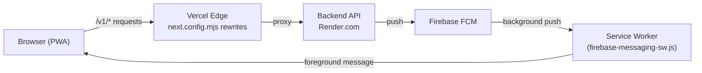
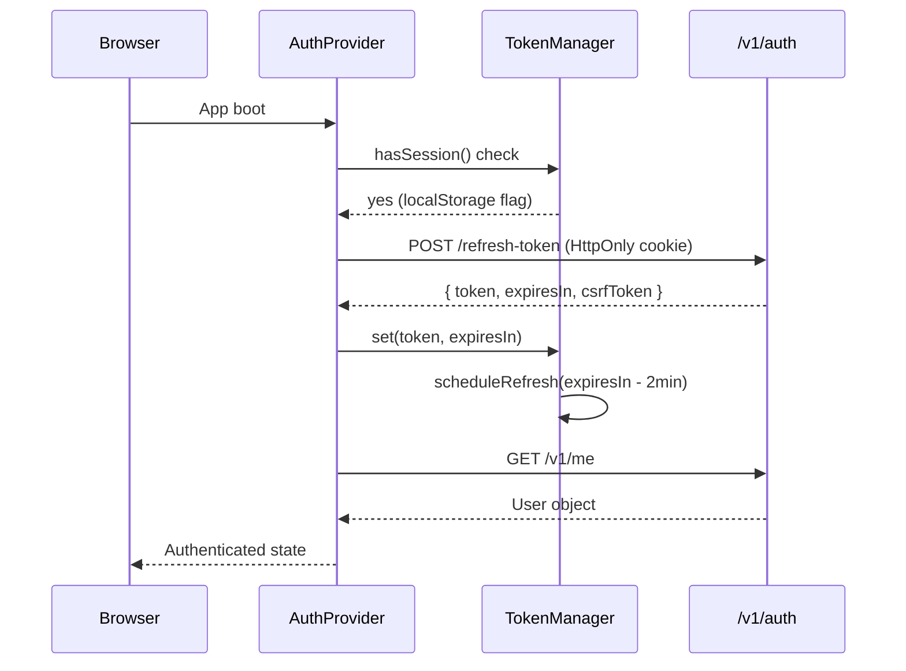
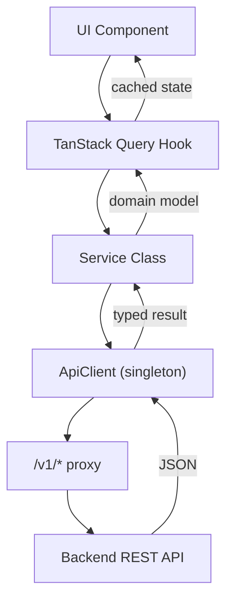
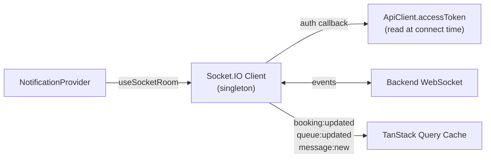

# Architecture

Frame Beauty is a **Next.js 15 App Router** PWA deployed on Vercel. The entire codebase is frontend-only; the backend lives at `https://frame-backend-apis.onrender.com` and is never called directly from the browser — all requests are proxied through Next.js rewrites.

---

## High-Level Overview

```
Browser  →  /v1/*  →  Next.js rewrite  →  https://frame-backend-apis.onrender.com/v1/*
```



The same-origin proxy is activated automatically: `ApiClient` compares `window.location.origin` with `NEXT_PUBLIC_API_URL` and sets `baseUrl = ""` when they differ (i.e. always in production), routing every request through `/v1/*`.

---

## Module Organisation

The project uses a **dual-tree pattern**:

| Tree                        | Purpose                                                             |
| --------------------------- | ------------------------------------------------------------------- |
| `app/_systems/<domain>/`    | Canonical business logic — services, types, hooks, domain providers |
| `app/_components/<domain>/` | UI components that consume the systems layer                        |
| `app/_auth/`                | Canonical auth module (exception: lives outside `_systems/`)        |
| `app/_systems/auth/`        | Re-export shim pointing to `app/_auth/`                             |
| `app/_core/`                | Shared infrastructure (ApiClient, i18n engine, core UI)             |

```
app/
├── _auth/           ← Auth (canonical)
├── _components/     ← UI layer
├── _constants/      ← Enum-like constants (genders, themes, …)
├── _core/           ← ApiClient, i18n engine, shared hooks/utils
├── _hooks/          ← Cross-cutting hooks (scroll, swipe, PWA)
├── _i18n/           ← i18n context + locale files
├── _lib/            ← Utilities (logger, telemetry, Firebase init)
├── _providers/      ← Global React providers composed at root
├── _services/       ← Legacy service re-exports (points to _systems)
├── _systems/        ← Domain business logic
│   ├── auth/
│   ├── bookings/
│   ├── chat/
│   ├── feed/
│   ├── marketplace/
│   ├── notifications/
│   ├── service-catalog/
│   ├── user/
│   └── admin/
└── _types/          ← Shared TypeScript types
```

---

## Authentication Architecture



| Credential    | Storage                                 | Notes                                 |
| ------------- | --------------------------------------- | ------------------------------------- |
| Access token  | JavaScript memory only                  | Never persisted, never in cookies     |
| Refresh token | HttpOnly secure cookie                  | Set by backend, invisible to JS       |
| Session hint  | `localStorage.hasRefreshToken`          | Non-sensitive; enables cross-tab sync |
| CSRF token    | In-memory (`csrf.ts`) + cookie fallback | Double-submit pattern                 |

**Cross-tab sync**: `StorageEvent` on `hasRefreshToken` triggers refresh when another tab logs in or out.

---

## Data Flow



All server state is managed by **TanStack Query v5**. Services are plain classes that call `apiClient.get/post/put/delete<T>()`. Hooks wrap services with `useQuery` / `useMutation` and own cache invalidation.

---

## Real-Time Layer



- **`app/_systems/notifications/services/socket.ts`** — lazily created singleton; `connect()`/`disconnect()` called by `AuthProvider.setAuth` / `clearAuth`.
- **Firebase FCM** handles background push when the tab is not active. The service worker at `public/firebase-messaging-sw.js` shows system notifications.

---

## Provider Hierarchy

Providers are composed in `app/layout.tsx` from outermost to innermost:

```
QueryProvider                  (TanStack Query client)
  ThemeProvider                (CSS class on <html>)
    I18nProvider               (locale + RTL)
      AuthProvider             (user, token, socket lifecycle)
        NotificationProvider   (real-time in-app notifications)
          PushNotificationProvider (FCM registration)
            SwipeNavigationProvider
              PwaInstallProvider
                ChatPanelProvider
                  {children}
```

---

## Error Handling Chain

```
throw Error
  → ApiClient catch         retryAfter parsing, 401 refresh retry, 403 CSRF retry
  → Service catch           clientLog (gated), auth errors re-thrown
  → Hook onError            user-facing toast / query error state
  → ErrorBoundary           reportError() → sendBeacon in prod
  → global-error.tsx        Next.js root error fallback
```

- **`app/_lib/client-logger.ts`**: `clientLog` / `clientDebug` — only emits when `NODE_ENV !== "production"` or `NEXT_PUBLIC_ENABLE_CLIENT_LOGS=true`.
- **`app/_lib/report-error.ts`**: `reportError()` — `navigator.sendBeacon` in production, `console.error` in development.

---

## i18n

Custom engine in `app/_i18n/`:

- **4 locales**: `en`, `ar`, `fr`, `tr`
- Arabic triggers `dir="rtl"` on `<html>`
- Pluralization and string interpolation built-in
- Locale preference stored on the user object; applied in `AuthProvider.setAuth`

---

## Technology Stack

| Concern      | Library                                  |
| ------------ | ---------------------------------------- |
| Framework    | Next.js 15 (App Router, Turbopack)       |
| UI           | React 19 + Tailwind CSS v4 + Radix UI    |
| Server state | TanStack Query v5                        |
| Forms        | React Hook Form v7 + Zod v4              |
| Real-time    | Socket.IO client v4                      |
| Push         | Firebase v12 FCM + VAPID                 |
| Language     | TypeScript 5.9 (strict)                  |
| Deployment   | Vercel (frontend) + Render.com (backend) |
