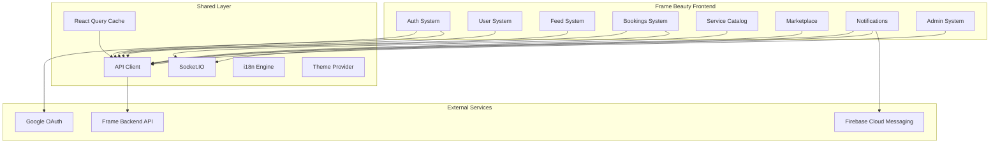

<p align="center">
  
</p>

<p align="center">
  <strong>Frame</strong> is a Tunisian startup building the all-in-one beauty platform — connecting clients with beauty lounges, agents, and a marketplace, all from a single mobile-first web app.
</p>

---

## What is Frame Beauty?

Frame Beauty is a social-commerce platform for the beauty industry in Tunisia. It lets:

- **Clients** discover beauty lounges, book appointments, join real-time queues, follow their favorite professionals, and shop beauty products
- **Lounges** manage their services, agents, bookings, queues, ratings, and an online storefront
- **Agents** (stylists, barbers, aestheticians) manage their daily queue and track their appointments
- **Admins** moderate content, manage users, review reports, and monitor system health

---

## System Architecture



---

## Systems

| System              | Directory                       | README                                           | Description                                                                                   |
| ------------------- | ------------------------------- | ------------------------------------------------ | --------------------------------------------------------------------------------------------- |
| **Auth**            | `app/_systems/auth/`            | [README](app/_systems/auth/README.md)            | JWT authentication, Google OAuth, signup, password reset, phone handling, route guards        |
| **User**            | `app/_systems/user/`            | [README](app/_systems/user/README.md)            | User types (client/lounge/agent), profiles, follow system, lounge management, settings        |
| **Feed**            | `app/_systems/feed/`            | [README](app/_systems/feed/README.md)            | Posts, reels, comments, likes, saves, hashtags, content moderation                            |
| **Bookings**        | `app/_systems/bookings/`        | [README](app/_systems/bookings/README.md)        | Appointment booking, real-time queues, drag-and-drop reordering, walk-in support              |
| **Service Catalog** | `app/_systems/service-catalog/` | [README](app/_systems/service-catalog/README.md) | Global service hierarchy, lounge-specific offerings, ratings, service suggestions             |
| **Marketplace**     | `app/_systems/marketplace/`     | [README](app/_systems/marketplace/README.md)     | Stores, products, orders, cart, checkout, reviews, wishlists, product categories              |
| **Notifications**   | `app/_systems/notifications/`   | [README](app/_systems/notifications/README.md)   | Real-time socket notifications, FCM push, sounds, deep-link navigation, 27 notification types |
| **Admin**           | `app/_systems/admin/`           | [README](app/_systems/admin/README.md)           | User moderation, content control, reports, system health, activity logs                       |
| **Chat**            | `app/_systems/chat/`            | _TBD_                                            | Real-time conversations, reactions, typing indicators, attachments                             |

---

## Tech Stack

| Layer        | Technology                                              |
| ------------ | ------------------------------------------------------- |
| Framework    | **Next.js 16** (App Router, Turbopack)                  |
| Language     | **TypeScript** (strict mode)                            |
| UI           | **React 19**, **Tailwind CSS v4**                       |
| State & Data | **TanStack React Query v5**                             |
| Real-time    | **Socket.IO** client                                    |
| Push         | **Firebase Cloud Messaging** (FCM)                      |
| Auth         | JWT access/refresh tokens, Google OAuth                 |
| i18n         | Custom engine — 4 locales (en, ar, fr, tr), RTL support |
| Icons        | **Lucide React**                                        |
| DnD          | **@dnd-kit/sortable** (queue reordering)                |
| Forms        | **React Hook Form** + **Zod**                           |

---

## Project Structure

```
app/
├── _systems/                   Domain systems (canonical code)
│   ├── auth/                   Authentication & authorization
│   ├── user/                   User profiles & social
│   ├── feed/                   Content (posts, reels, comments)
│   ├── bookings/               Booking & queue management
│   ├── service-catalog/        Service hierarchy & ratings
│   ├── marketplace/            E-commerce (stores, products, orders)
│   ├── notifications/          Notifications & push
│   ├── admin/                  Platform administration
│   └── chat/                   Real-time messaging
├── _components/                UI components (mirrors _systems domains)
├── _hooks/                     Shared hooks
├── _lib/                       Utility functions
├── _providers/                 React context providers
├── _services/                  Legacy service barrel (re-exports from _systems)
├── _i18n/                      Internationalization engine + locales
├── _constants/                 App-wide constants
├── _core/                      Core UI primitives + shared infra
├── _auth/                      Auth provider, guards, hooks
└── [route folders]/            Next.js pages (home, profile, store, admin, etc.)
```

### Dual-Tree Convention

Each domain has code in two places:

- `app/_systems/<domain>/` — **canonical**: types, services, hooks, business logic
- `app/_components/<domain>/` — **mirror**: UI components consuming the system hooks

---

## Getting Started

### Prerequisites

- **Node.js** 18+
- **npm** 9+

### Install & Run

```bash
npm install
npm run dev
```

Dev server starts at **http://localhost:2111** (Turbopack).

### Build

```bash
npm run build
npm start
```

### Environment Variables

Create a `.env.local` with:

```env
NEXT_PUBLIC_API_URL=https://backend-server-dob4.onrender.com
NEXT_PUBLIC_GOOGLE_AUTH_BASE_URL=<optional OAuth API base URL override>
NEXT_PUBLIC_FIREBASE_API_KEY=<Firebase API key>
NEXT_PUBLIC_FIREBASE_AUTH_DOMAIN=<Firebase auth domain>
NEXT_PUBLIC_FIREBASE_PROJECT_ID=<Firebase project ID>
NEXT_PUBLIC_FIREBASE_MESSAGING_SENDER_ID=<FCM sender ID>
NEXT_PUBLIC_FIREBASE_APP_ID=<Firebase app ID>
NEXT_PUBLIC_FIREBASE_VAPID_KEY=<FCM VAPID key>
NEXT_PUBLIC_GOOGLE_CLIENT_ID=<Google OAuth client ID>
```

### Deploying to Vercel

1. Create a new project on Vercel and connect your Git repository.
2. Add environment variables from `.env.example` to the Vercel project settings (Production & Preview).
3. Set the build command to `npm run vercel-build` and the output directory to `.next` (Vercel autoconfigures for Next.js usually).
4. Push to your main branch — Vercel will build and deploy automatically.

If you need to serve on a custom port locally for testing, `npm run dev` uses port `2111` by default.

---

## Internationalization

4 supported locales with full RTL support:

| Code | Language | Direction |
| ---- | -------- | --------- |
| `en` | English  | LTR       |
| `fr` | French   | LTR       |
| `ar` | Arabic   | RTL       |
| `tr` | Turkish  | LTR       |

Locale files: `app/_i18n/locales/{en,fr,ar,tr}.ts`

---

## Git Conventions

- **Branch format**: `<scope>/<feature>/feat` or `<scope>/<fix>/fix`
- **Commit format**: `<type>(scope): <subject>` (max 100 characters)
- **Hooks**: Husky `commit-msg` enforces message format; lint-staged runs ESLint + Prettier on staged `*.ts?(x)` files

---

## License

MIT
