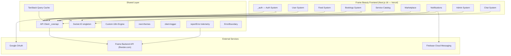
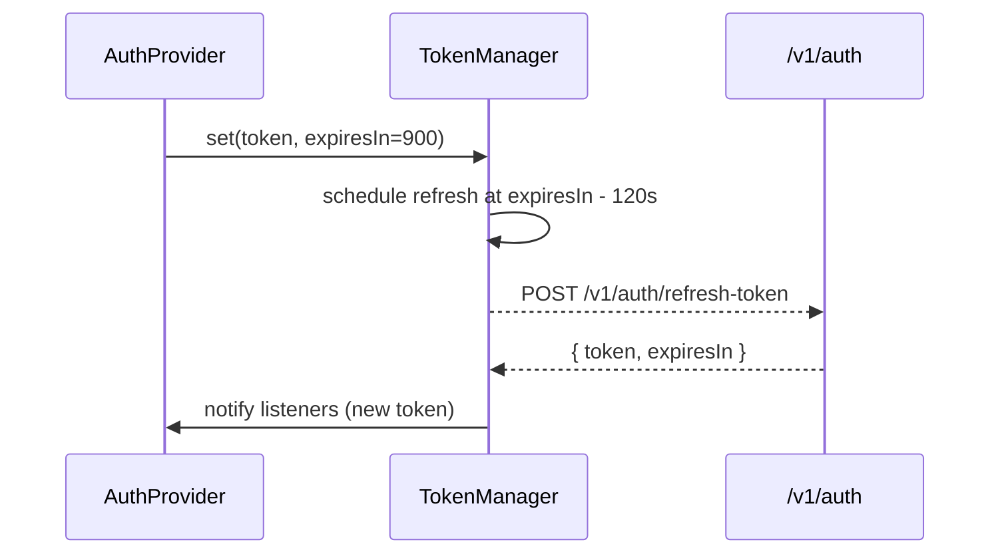

<p align="center">
  
</p>

<p align="center">
  <strong>Frame Beauty</strong> is a Tunisian startup building the all-in-one beauty platform — connecting clients with beauty lounges, agents, and a marketplace, all from a single mobile-first web app.
  <br/>
  Production: <a href="https://framebeauty.tn">https://framebeauty.tn</a> · <a href="https://www.framebeauty.tn">https://www.framebeauty.tn</a>
</p>

---

## What is Frame Beauty?

Frame Beauty is a social-commerce platform for the beauty industry in Tunisia. It lets:

- **Clients** discover beauty lounges, book appointments, join real-time queues, follow their favorite professionals, and shop beauty products
- **Lounges** manage their services, agents, bookings, queues, ratings, and an online storefront
- **Agents** (stylists, barbers, aestheticians) manage their daily queue and track their appointments
- **Admins** moderate content, manage users, review reports, and monitor system health

---

## System Architecture



---

## Domain Systems

| System              | Directory                       | README                                           | Description                                                                                   |
| ------------------- | ------------------------------- | ------------------------------------------------ | --------------------------------------------------------------------------------------------- |
| **Auth**            | `app/_auth/` + `app/_systems/auth/` | [README](app/_systems/auth/README.md)        | JWT authentication, Google OAuth, signup, password reset, phone handling, route guards        |
| **User**            | `app/_systems/user/`            | [README](app/_systems/user/README.md)            | User types (client/lounge/agent), profiles, follow system, lounge management, settings        |
| **Feed**            | `app/_systems/feed/`            | [README](app/_systems/feed/README.md)            | Posts, reels, comments, likes, saves, hashtags, content moderation                            |
| **Bookings**        | `app/_systems/bookings/`        | [README](app/_systems/bookings/README.md)        | Appointment booking, real-time queues, drag-and-drop reordering, walk-in support              |
| **Service Catalog** | `app/_systems/service-catalog/` | [README](app/_systems/service-catalog/README.md) | Global service hierarchy, lounge-specific offerings, ratings, service suggestions             |
| **Marketplace**     | `app/_systems/marketplace/`     | [README](app/_systems/marketplace/README.md)     | Stores, products, orders, cart, checkout, reviews, wishlists, product categories              |
| **Notifications**   | `app/_systems/notifications/`   | [README](app/_systems/notifications/README.md)   | Real-time socket notifications, FCM push, sounds, deep-link navigation, 27 notification types |
| **Admin**           | `app/_systems/admin/`           | [README](app/_systems/admin/README.md)           | User moderation, content control, reports, system health, activity logs                       |
| **Chat**            | `app/_systems/chat/`            | _TBD_                                            | Real-time conversations, reactions, typing indicators, attachments                            |

---

## Tech Stack

| Layer        | Technology                                                            |
| ------------ | --------------------------------------------------------------------- |
| Framework    | **Next.js 16** (App Router, Turbopack)                                |
| Language     | **TypeScript 5.9** (strict mode)                                      |
| UI           | **React 19**, **Tailwind CSS v4**, **Radix UI** primitives            |
| State & Data | **TanStack React Query v5**                                           |
| Real-time    | **Socket.IO client v4**                                               |
| Push         | **Firebase v12** (FCM) + VAPID                                        |
| Auth         | JWT (memory-only access token), HttpOnly refresh cookie, Google OAuth |
| i18n         | Custom engine — 4 locales (en, ar, fr, tr), RTL support               |
| Forms        | **React Hook Form v7** + **Zod v4**                                   |
| Icons        | **Lucide React**                                                      |
| DnD          | **@dnd-kit/sortable** (queue reordering)                              |
| Animation    | **@lottiefiles/dotlottie-react**                                      |
| Date         | **date-fns v4**, **react-day-picker v9**                              |
| Toasts       | **Sonner v2**                                                         |
| Deployment   | **Vercel** (frontend) + **Render.com** (backend)                     |

---

## Project Structure

```
app/
├── _auth/                      Canonical auth module (provider, guards, hooks, service, lib)
├── _systems/                   Domain systems (canonical business logic)
│   ├── auth/                   Re-export shims → app/_auth + auth components
│   ├── user/                   User profiles, lounge management, follow system
│   ├── feed/                   Posts, reels, comments, likes, saves, hashtags
│   ├── bookings/               Appointment booking, real-time queue management
│   ├── service-catalog/        Service hierarchy, lounge offerings, ratings
│   ├── marketplace/            E-commerce: stores, products, cart, orders
│   ├── notifications/          In-app + FCM push notifications, socket events
│   ├── admin/                  Platform administration and moderation
│   └── chat/                   Real-time messaging
├── _components/                UI components (mirrors _systems domains)
│   ├── agents/                 Agent-specific UI
│   ├── bookings/               Booking wizard and queue UI
│   ├── clients/                Client-specific UI
│   ├── common/                 ErrorBoundary, ServiceWorkerRegister, etc.
│   ├── content/                Feed content (posts, reels)
│   ├── forms/                  Shared form components, progress bar
│   ├── layout/                 Header, footer, main content wrapper
│   ├── lounges/                Lounge-specific UI
│   ├── marketplace/            Marketplace UI
│   ├── posts/                  Post cards and detail UI
│   ├── profile/                Profile UI components
│   ├── queue/                  Queue display and controls
│   ├── services/               Service catalog UI
│   ├── skeletons/              Loading skeleton screens
│   └── ui/                     Primitive design system (Radix-based)
├── _hooks/                     Shared hooks (scroll, swipe, notifications, hashtags, etc.)
├── _lib/                       Utilities (client-logger, report-error, sound-manager, etc.)
├── _providers/                 React context providers (theme, query, notifications, etc.)
├── _services/                  Service barrel (re-exports from _systems services)
├── _i18n/                      i18n engine + 4 locale dictionaries (en, ar, fr, tr)
├── _constants/                 App-wide constants (navigation, services, themes, etc.)
├── _core/                      Core API client, shared UI primitives, types
│   ├── api/                    ApiClient class, API_BASE_URL, CSRF helpers
│   ├── components/             Shared component re-exports
│   ├── hooks/                  Core hooks
│   ├── providers/              Core providers
│   └── types/                  Shared TypeScript types
└── [route folders]/            Next.js pages
    ├── admin/                  Admin dashboard pages
    ├── agent/                  Agent-facing pages
    ├── auth/                   Auth pages (redirect, callback)
    ├── book/                   Booking flow pages
    ├── bookings/               User's bookings list
    ├── clients/                Client profile pages
    ├── hashtag/                Hashtag browsing
    ├── home/                   Feed / home page
    ├── lounge/                 Lounge dashboard & management
    ├── lounges/                Public lounge discovery
    ├── marketplace/            Marketplace browse & checkout
    ├── messages/               Chat / messages pages
    ├── notifications/          Notifications list
    ├── profile/                Current user profile
    ├── queue/                  Public queue view
    ├── reels/                  Reels feed
    ├── saved/                  Saved posts
    ├── settings/               User settings
    └── store/                  Marketplace store pages
```

### Dual-Tree Convention

Every domain has code in two places:

- `app/_systems/<domain>/` — **canonical**: types, services, hooks, business logic. `app/_auth/` is the canonical auth module.
- `app/_components/<domain>/` — **UI components** consuming the system hooks

`app/_systems/auth/` and some `app/_auth/components/` files are **re-export shims** — they forward all exports to the canonical location. Consumers should always import from `@/app/_auth` for auth.

---

## Authentication System

See [app/_systems/auth/README.md](app/_systems/auth/README.md) for the full authentication reference.

### Security Model

```
┌─────────────────────────────────────────────────────────┐
│  Access Token    → JavaScript variable (memory only)    │
│  Refresh Token   → HttpOnly cookie (backend-managed)    │
│  Session Flag    → localStorage: "hasRefreshToken"      │
│                    (non-sensitive boolean hint only)     │
│  CSRF Token      → sessionStorage + X-CSRF-Token header │
└─────────────────────────────────────────────────────────┘
```

| Token        | Storage                        | Lifetime      | Purpose                  |
| ------------ | ------------------------------ | ------------- | ------------------------ |
| Access Token | JavaScript variable (memory)   | 15 min (900s) | API authorization        |
| Refresh Token| HttpOnly secure cookie         | Server-managed| Silent re-authentication |
| Session Flag | `localStorage.hasRefreshToken` | Until logout  | Cross-tab sync hint      |

### Same-Origin Proxy

In production, all browser API calls go through a Next.js `rewrites()` rule:

```
Browser → https://framebeauty.tn/v1/* → https://frame-backend-apis.onrender.com/v1/*
```

This ensures `refreshToken` cookies (set on the backend) are sent correctly on `/v1/auth/refresh-token` without cross-origin CORS issues. The `ApiClient` detects when the configured `NEXT_PUBLIC_API_URL` differs from `window.location.origin` and automatically sets `baseUrl = ""` (same-origin) in the browser.

### Token Lifecycle



**Proactive refresh**: `TokenManager` schedules a `setTimeout` 2 minutes before token expiry, ensuring seamless session continuity.

**Cross-tab sync**: A `StorageEvent` listener on `hasRefreshToken` triggers an independent refresh call in each tab when another tab logs in or out.

### Canonical Auth Import

All code must import auth from `@/app/_auth`:

```ts
import { useAuth, AuthProvider, authService, tokenManager } from "@/app/_auth"
```

Do **not** import from `@/app/_systems/auth` — those files are re-export shims.

### Route Guards

| Guard            | Location                          | Purpose                         |
| ---------------- | --------------------------------- | ------------------------------- |
| `AuthGuard`      | `app/_auth/guards/auth-guard.tsx` | Redirects unauthenticated users |
| `AdminGuard`     | `app/_auth/guards/admin-guard.tsx`| Admin-only page protection      |
| `AgentGuard`     | `app/_auth/guards/agent-guard.tsx`| Agent-only page protection      |
| `useRequireAuth` | `app/_auth/hooks/use-require-auth`| Page-level hook guard           |

---

## API Client

**Location**: `app/_core/api/api.ts`

The `ApiClient` class is the single HTTP gateway for all REST calls.

### Key Behaviours

| Feature              | Detail                                                                                      |
| -------------------- | ------------------------------------------------------------------------------------------- |
| Base URL             | `""` (same-origin proxy) in browser production; `http://0.0.0.0:2000` rewritten to LAN host in development |
| Default timeout      | 30 seconds per request                                                                      |
| Per-request timeout  | `ApiRequestOptions.timeoutMs` override (e.g. signup uses 90 000 ms)                        |
| Authorization        | `Authorization: <accessToken>` header from memory                                          |
| CSRF                 | `X-CSRF-Token` header on state-changing requests (POST/PUT/PATCH/DELETE)                   |
| 401 handling         | Calls `refreshTokenCallback` once; retries the original request with new token             |
| Auth failure         | Calls `authFailureCallback` (clears auth + reports error) after refresh also fails         |
| Rate-limit errors    | Parses `retryAfter` from response body and `Retry-After` header; attaches to thrown error  |
| Debug logging        | Gated behind `isAuthDebugEnabled()` — never logs in production unless explicitly enabled   |

### `ApiRequestOptions`

```ts
type ApiRequestOptions = {
  suppressAuthFailure?: boolean  // Prevent global auth failure handler on this call
  timeoutMs?: number             // Override the 30s default timeout for this call
}
```

Methods with options support: `getWithOptions`, `postWithOptions`, `putWithOptions`, `deleteWithOptions`, `patchWithOptions`.

### Exported Constants

```ts
export const API_BASE_URL         // Computed base URL for REST and Socket.IO
export const GOOGLE_AUTH_BASE_URL // OAuth-specific base URL
export const apiClient            // Singleton ApiClient instance
```

---

## Error Handling & Telemetry

### `reportError` — `app/_lib/report-error.ts`

Central error reporting utility used by `ErrorBoundary`, `AuthProvider`, and any catch block that needs telemetry.

```ts
reportError(error: unknown, context?: Record<string, unknown>): void
```

| Environment | Behaviour                                                                              |
| ----------- | -------------------------------------------------------------------------------------- |
| Development | `console.error("[reportError]", payload)`                                              |
| Production  | `navigator.sendBeacon(NEXT_PUBLIC_ERROR_REPORTING_ENDPOINT, payload)` — never throws  |

Payload includes: serialized error (name, message, stack), context object, current URL, user agent, and ISO timestamp.

### `ErrorBoundary` — `app/_components/common/errorBoundary.tsx`

React class component that wraps the component tree. On uncaught render errors it calls `reportError()` then renders a fallback UI (hides stack trace in production). Also re-exported as a shim from `app/_core/components/common/errorBoundary.tsx`.

### Auth failure telemetry

`AuthProvider.handleAuthFailure()` calls `reportError()` before clearing auth state and redirecting the user, preserving the failure context for monitoring.

---

## Client Logging

**Location**: `app/_lib/client-logger.ts`

Production-safe logging utility. All `console.log` / `console.debug` in runtime hot paths must go through these functions — never raw `console.*`.

```ts
clientLog(...args: unknown[]): void    // Gated console.log
clientDebug(...args: unknown[]): void  // Gated console.debug
```

**Suppression logic**: logs are silenced when `NODE_ENV === "production"` unless `NEXT_PUBLIC_ENABLE_CLIENT_LOGS=true`.

**Enable in production temporarily**:
```js
// Browser DevTools console
localStorage.setItem("frame:debugAuth", "true")
location.reload()
```

**Used in**: Socket.IO singleton, queue socket handlers, lounge service, API client.

---

## Real-Time Layer

### Socket.IO — `app/_systems/notifications/services/socket.ts`

Singleton Socket.IO client. Created once on first call to `getSocket()`, reused on subsequent calls.

```ts
getSocket(): Socket       // Lazy-initialize and return the singleton
disconnectSocket(): void  // Logout / auth failure cleanup
```

| Config                  | Value                                   |
| ----------------------- | --------------------------------------- |
| Transport               | WebSocket, falling back to polling      |
| Reconnection attempts   | 10                                      |
| Reconnection delay      | 1 s initial, max 10 s                   |
| Connection timeout      | 20 s                                    |
| Token delivery          | `auth` callback (never in URL/query)    |

The `auth` option reads `apiClient.accessToken` at connection time so reconnects always use the freshest token.

### Firebase FCM — `app/_lib/firebase.ts`

Push notifications via Firebase Cloud Messaging with VAPID key. The service worker at `public/firebase-messaging-sw.js` handles background notifications.

---

## i18n System

**Location**: `app/_i18n/`

Custom translation engine with no runtime dependencies. 4 supported locales: `en`, `ar`, `fr`, `tr`.

```ts
const { t, locale, setLocale } = useTranslation()
t("key")                        // Basic lookup
t("key", { count: 3 })          // Automatic pluralization (key_zero / key_one / key_other)
t("key", { name: "Alice" })     // Interpolation ({name} tokens)
```

**Lookup chain**: active locale → English fallback → raw key (visible in dev if key is missing).

**RTL**: Arabic locale (`ar`) automatically applies right-to-left layout direction.

**Locale persistence**: User's preferred locale is stored on the backend user profile (`language` field) and restored on login via `AuthProvider`.

---

## Provider Hierarchy

The root layout (`app/layout.tsx`) wraps the entire app in this provider tree (outermost first):

```
LanguageProvider
  ThemeProviderComponent
    QueryProvider
      AuthProvider
        ChatPanelProvider
          NotificationProvider
            PushNotificationProvider
              PwaInstallProvider
                SwipeNavigationProvider
                  ProgressProvider
                    ServiceWorkerRegister
                    [App content]
```

---

## Shared Hooks — `app/_hooks/`

| Hook                     | Purpose                                                       |
| ------------------------ | ------------------------------------------------------------- |
| `useHashtagComposer`     | Hashtag state management for post/reel create & edit dialogs  |
| `useFrameScroll`         | Scroll position tracking with direction awareness             |
| `useScrollDirection`     | Detects scroll up/down for header hide/show                   |
| `useScrollToTarget`      | Smooth scroll to a DOM element ref                            |
| `useMobileNavVisibility` | Controls bottom navigation bar show/hide on scroll            |
| `usePullToRefresh`       | Touch-based pull-to-refresh gesture                           |
| `usePushNotifications`   | FCM permission request and token registration                 |
| `usePwaInstall`          | Browser PWA install prompt management                         |
| `useSwipeNavigation`     | Horizontal swipe for back/forward navigation on mobile        |
| `useSocketRoom`          | Join/leave a Socket.IO room with cleanup on unmount           |
| `useImageSlider`         | State management for image carousel/slider components         |
| `useBadge`               | Notification badge counter management                         |

---

## Environment Variables

Use `.env` for local development and `.env.production` for production builds. Do **not** use `.env.local` — Next.js loads it for every environment and it would override both files.

### Required

```env
NEXT_PUBLIC_API_URL=http://0.0.0.0:2000
NEXT_PUBLIC_FRONTEND_URL=http://0.0.0.0:2111
NEXT_PUBLIC_FIREBASE_API_KEY=<Firebase API key>
NEXT_PUBLIC_FIREBASE_AUTH_DOMAIN=<Firebase auth domain>
NEXT_PUBLIC_FIREBASE_PROJECT_ID=<Firebase project ID>
NEXT_PUBLIC_FIREBASE_MESSAGING_SENDER_ID=<FCM sender ID>
NEXT_PUBLIC_FIREBASE_APP_ID=<Firebase app ID>
NEXT_PUBLIC_FIREBASE_VAPID_KEY=<FCM VAPID key>
NEXT_PUBLIC_GOOGLE_CLIENT_ID=<Google OAuth client ID>
NEXT_PUBLIC_GOOGLE_MAPS_API_KEY=<Google Maps browser key>
```

### Optional

```env
NEXT_PUBLIC_GOOGLE_AUTH_BASE_URL=<OAuth API base URL if different from NEXT_PUBLIC_API_URL>
GOOGLE_AUTH_LOCAL_API_URL=<Server-side OAuth base URL for dev>
NEXT_PUBLIC_USE_API_PROXY=true         # Set to "false" to bypass same-origin proxy
NEXT_PUBLIC_ERROR_REPORTING_ENDPOINT=  # Client error telemetry endpoint (sendBeacon)
NEXT_PUBLIC_ENABLE_CLIENT_LOGS=false   # Set to "true" to enable clientLog/clientDebug in prod
NEXT_PUBLIC_ENABLE_AUTH_DEBUG=false    # Set to "true" to enable auth debug output in prod
```

---

## Development

### Prerequisites

- **Node.js** 18+
- **npm** 9+

### Install & Run

```bash
npm install
npm run dev       # Turbopack dev server on http://0.0.0.0:2111
```

The dev server is reachable from any device on the same LAN at `http://<your-ip>:2111`. The API client automatically rewrites `0.0.0.0:2000` to the browser's current hostname.

### Other Scripts

```bash
npm run build        # Production Next.js build
npm start            # Start production server on port 2111
npm run vercel-build # Alias for `next build` used by Vercel CI
npm run lint         # ESLint
npm run lint:fix     # ESLint with auto-fix
npm run typecheck    # TypeScript compile check (no emit)
npm run deadcode     # ts-prune dead export detection
```

### Git Conventions

Commit messages follow the Conventional Commits format enforced by `git-commit-msg-linter`:

```
<type>(scope): <subject>
```

- Max 100 characters
- Subject: not capitalized, no trailing period
- Types: `feat`, `fix`, `docs`, `style`, `refactor`, `test`, `chore`, `perf`, `ci`, `build`, `temp`

---

## Production Deployment

### Vercel (Frontend)

1. Connect your Git repository to a Vercel project.
2. Add all environment variables (Required + Optional) in Vercel Project Settings → Environment Variables for **Production** and **Preview**.
3. Build command: `npm run vercel-build`. Output: `.next` (auto-detected by Vercel).
4. Push to your main branch — Vercel builds and deploys automatically.

### Backend (Render.com)

Backend API is deployed at `https://frame-backend-apis.onrender.com`. The frontend proxies all `/v1/*` requests to it via Next.js `rewrites()`, enabling same-origin cookie delivery for the HttpOnly refresh token.

### Image Domains

Allowed image hostnames for `next/image` optimization (configured in `next.config.mjs`):

- `utfs.io` — UploadThing
- `lh3.googleusercontent.com` — Google profile pictures
- `images.unsplash.com` — Placeholder/stock images
- `res.cloudinary.com` — Cloudinary CDN
- `*.r2.dev` — Cloudflare R2 CDN

---

## Internationalization

4 supported locales with full RTL support:

| Code | Language | Direction |
| ---- | -------- | --------- |
| `en` | English  | LTR       |
| `fr` | French   | LTR       |
| `ar` | Arabic   | RTL       |
| `tr` | Turkish  | LTR       |

Locale files: `app/_i18n/locales/{en,fr,ar,tr}.ts`

---

## Git Conventions

- **Branch format**: `<scope>/<feature>/feat` or `<scope>/<fix>/fix`
- **Commit format**: `<type>(scope): <subject>` (max 100 characters)
- **Hooks**: Husky `commit-msg` enforces message format; lint-staged runs ESLint + Prettier on staged `*.ts?(x)` files

---

## License

MIT
