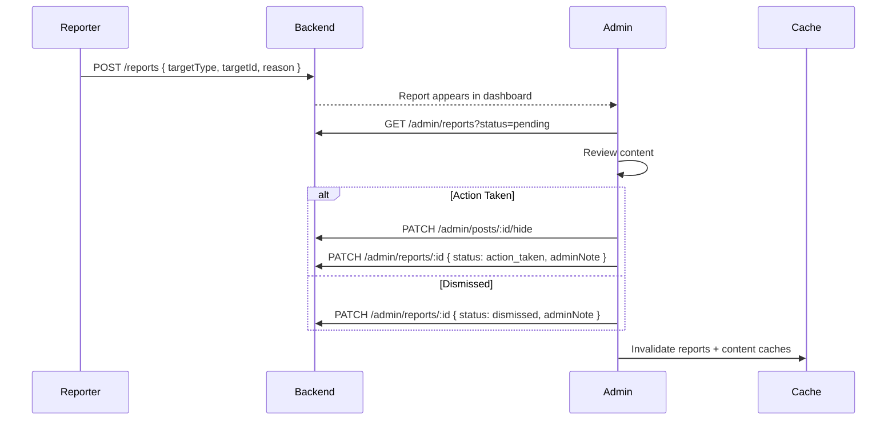
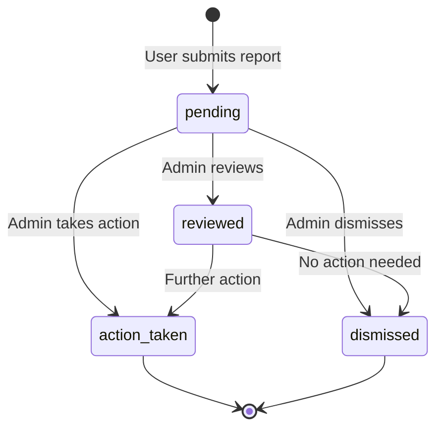
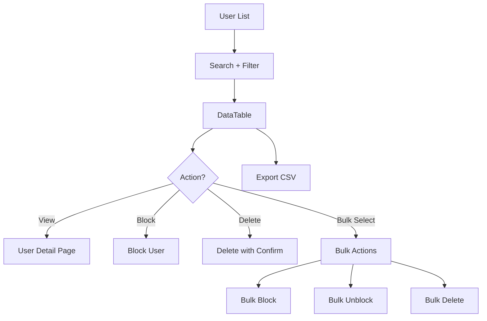
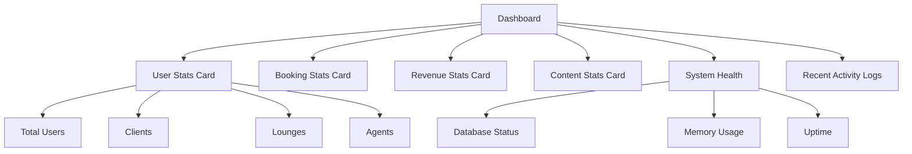
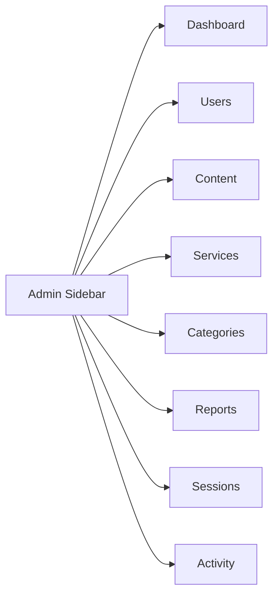

# Admin System

The admin system provides platform-wide management for Frame Beauty — user moderation, content control, service/category administration, system health monitoring, and activity logging.

---

## Architecture Overview

```mermaid
graph TB
    subgraph AdminSystem["Admin System"]
        subgraph Services["Services"]
            AS[AdminService]
        end

        subgraph Hooks["React Query Hooks"]
            UA[useAdmin]
            UAC[useAdminContent]
        end

        subgraph Components["UI Components"]
            DT[DataTable]
            AH[AdminHeader]
            ASB[AdminSidebar]
            SC[StatCard]
            CD[ConfirmDialog]
        end

        subgraph Pages["Route Pages"]
            DASH[/admin - Dashboard]
            USERS[/admin/users]
            CONTENT[/admin/content]
            SVCS[/admin/services]
            REPORTS[/admin/reports]
        end
    end

    subgraph External
        API[API Client /v1/admin]
        QC[React Query Cache]
    end

    AS --> API
    UA --> AS
    UAC --> AS
    UA --> QC
    Components --> UA
    Pages --> Components
```

---

## Data Model

```mermaid
classDiagram
    class AdminUser {
        +string _id
        +string email
        +string firstName
        +string lastName
        +string phoneNumber
        +UserType type
        +boolean isBlocked
        +string createdAt
    }

    class SessionUser {
        +string userId
        +boolean online
        +string lastSeen
        +number activeSessions
    }

    class SystemStats {
        +number totalUsers
        +number clients
        +number lounges
        +number agents
    }

    class SystemHealth {
        +string database
        +MemoryUsage memoryUsage
        +number uptime
    }

    class DashboardStats {
        +SystemStats users
        +object bookings
        +object revenue
        +object content
    }

    class ActivityLogEntry {
        +string _id
        +string adminId
        +string action
        +string targetType
        +string targetId
        +object details
        +string createdAt
    }

    class AdminReport {
        +string _id
        +string reporter
        +ReportTargetType targetType
        +string targetId
        +string reason
        +ReportStatus status
        +string adminNote
        +string createdAt
    }

    class AdminService_Type {
        +string _id
        +string name
        +string slug
        +string categoryId
        +number baseDuration
        +string description
    }

    class AdminServiceCategory {
        +string _id
        +string name
        +string description
    }
```



---

## Directory Structure

```
app/_systems/admin/
├── index.ts
├── types/
│   └── admin.ts                       All admin types + DTOs
├── services/
│   └── admin.service.ts               Admin REST API methods
├── hooks/
│   ├── useAdmin.ts                    User management hooks
│   └── useAdminContent.ts            Content moderation hooks
├── constants/
│   └── navigation.ts                  Admin sidebar nav items
└── components/
    ├── admin-header.tsx               Top header with breadcrumbs
    ├── admin-sidebar.tsx              Navigation sidebar
    ├── confirm-dialog.tsx             Reusable confirmation modal
    ├── data-table.tsx                 Generic sortable/searchable table
    └── stat-card.tsx                  Dashboard stat card

app/admin/                             Route pages
├── page.tsx                           Dashboard
├── layout.tsx                         Admin layout wrapper
├── users/page.tsx                     User management
├── content/page.tsx                   Content moderation
├── services/page.tsx                  Service management
├── categories/page.tsx                Category management
├── reports/page.tsx                   Report review
├── sessions/page.tsx                  Active sessions
└── activity/page.tsx                  Activity logs
```

---

## Admin Service API

### User Management

| Method | Endpoint | Description |
|--------|----------|-------------|
| `getUsers` | `GET /v1/admin/users?page&limit&search&type&isBlocked` | Paginated user list |
| `getUserById` | `GET /v1/admin/users/:id` | User detail |
| `createUser` | `POST /v1/admin/users` | Create user |
| `updateUser` | `PUT /v1/admin/users/:id` | Update user |
| `deleteUser` | `DELETE /v1/admin/users/:id` | Delete user |
| `blockUser` | `PATCH /v1/admin/users/:id/block` | Block user |
| `unblockUser` | `PATCH /v1/admin/users/:id/unblock` | Unblock user |
| `bulkBlockUsers` | `PATCH /v1/admin/users/bulk-block` | Block multiple |
| `bulkUnblockUsers` | `PATCH /v1/admin/users/bulk-unblock` | Unblock multiple |
| `bulkDeleteUsers` | `DELETE /v1/admin/users/bulk-delete` | Delete multiple |
| `exportUsers` | `GET /v1/admin/users/export` | Export CSV |

### Session Monitoring

| Method | Endpoint | Description |
|--------|----------|-------------|
| `getActiveSessions` | `GET /v1/admin/sessions` | Currently active sessions |

### System

| Method | Endpoint | Description |
|--------|----------|-------------|
| `getSystemStats` | `GET /v1/admin/stats` | User/booking/revenue counts |
| `getSystemHealth` | `GET /v1/admin/health` | DB status, memory, uptime |
| `getDashboardStats` | `GET /v1/admin/dashboard` | Combined dashboard stats |
| `getActivityLogs` | `GET /v1/admin/activity?page&limit` | Activity log (paginated) |

### Reports

| Method | Endpoint | Description |
|--------|----------|-------------|
| `getReports` | `GET /v1/admin/reports?page&limit&status` | Content reports |
| `reviewReport` | `PATCH /v1/admin/reports/:id` | Review with note + status |

### Service Management

| Method | Endpoint | Description |
|--------|----------|-------------|
| `getServices` | `GET /v1/admin/services?page&limit&search&categoryId` | All services |
| `createService` | `POST /v1/admin/services` | Create global service |
| `updateService` | `PUT /v1/admin/services/:id` | Update service |
| `deleteService` | `DELETE /v1/admin/services/:id` | Delete service |
| `getCategories` | `GET /v1/admin/service-categories` | All categories |
| `createCategory` | `POST /v1/admin/service-categories` | Create category |
| `updateCategory` | `PUT /v1/admin/service-categories/:id` | Update category |
| `deleteCategory` | `DELETE /v1/admin/service-categories/:id` | Delete category |

---

## Content Moderation Flow



### Content Actions (useAdminContent)

| Hook | Action | Scope |
|------|--------|-------|
| `useHidePost` | Hide post from feeds | Single |
| `useUnhidePost` | Restore post visibility | Single |
| `useAdminDeletePost` | Permanently delete post | Single |
| `useHideReel` | Hide reel from feeds | Single |
| `useUnhideReel` | Restore reel visibility | Single |
| `useAdminDeleteReel` | Permanently delete reel | Single |
| `useHideComment` | Hide comment | Single |
| `useUnhideComment` | Restore comment | Single |
| `useAdminDeleteComment` | Permanently delete comment | Single |
| `useBulkHidePosts` | Hide multiple posts | Bulk |
| `useBulkDeletePosts` | Delete multiple posts | Bulk |
| `useBulkHideReels` | Hide multiple reels | Bulk |
| `useBulkDeleteReels` | Delete multiple reels | Bulk |

---

## Report Status Flow



---

## User Management Flow



### User Filters

| Parameter | Type | Options |
|-----------|------|---------|
| `search` | string | Name, email, phone |
| `type` | enum | `client`, `lounge`, `admin` |
| `isBlocked` | boolean | Blocked status |
| `page` | number | Page number |
| `limit` | number | Items per page |

---

## Dashboard Stats



---

## DataTable Component

The generic `DataTable` component powers all admin list views:

| Feature | Description |
|---------|-------------|
| Sorting | Click column headers to sort asc/desc |
| Search | Debounced text search across fields |
| Pagination | Server-side pagination with page size |
| Row selection | Checkbox multi-select for bulk ops |
| Actions | Per-row dropdown menu (edit, block, delete) |
| Loading | Skeleton rows while fetching |
| Empty state | Custom empty message |

---

## Admin Navigation



Each navigation item includes an icon, label, and route path. The sidebar highlights the active route and collapses on mobile.

---

## Error Handling

| Error | Response |
|-------|----------|
| 401 Unauthorized | Redirect to login |
| 403 Forbidden | "Admin access required" message |
| 404 Not Found | "Resource not found" message |
| 429 Rate Limited | Retry after cooldown |
| 500 Server Error | Generic error toast |

All admin mutations show a confirmation dialog before destructive actions (delete, block, bulk operations).
