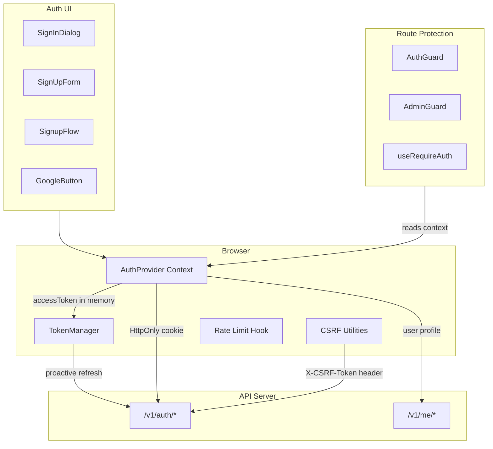
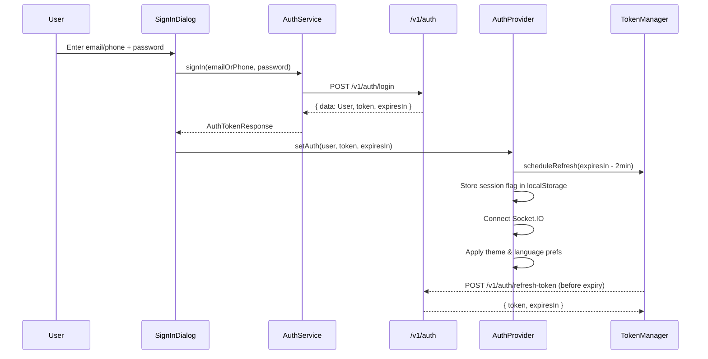
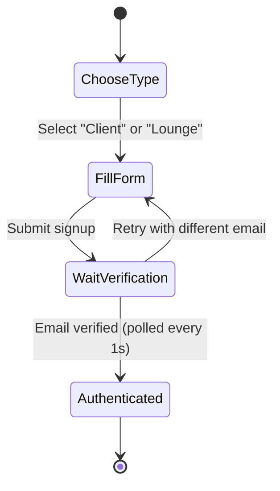
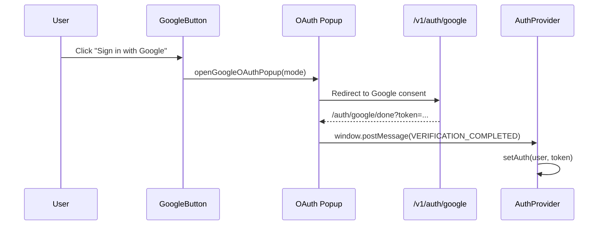
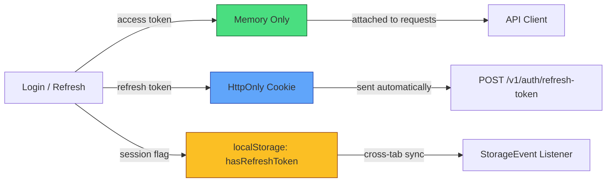
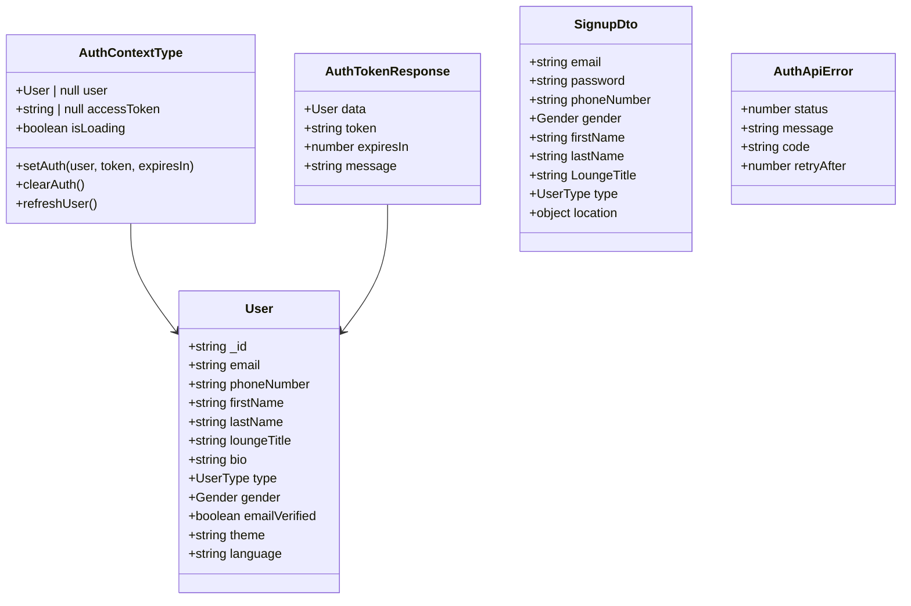
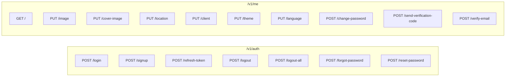
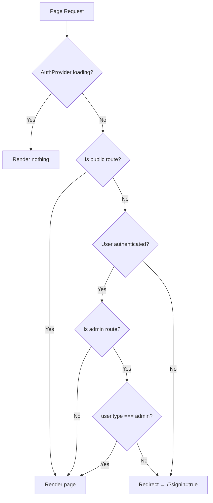
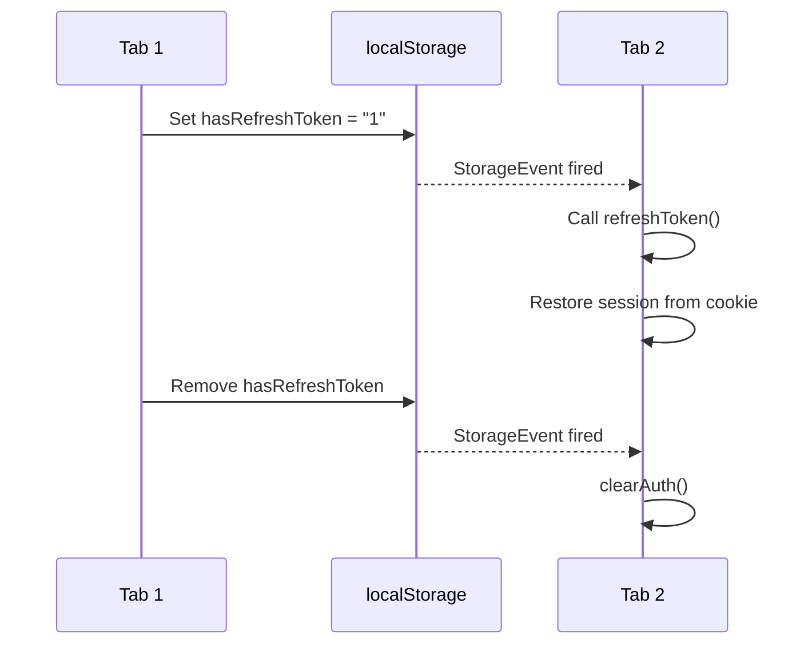

# Authentication System

The authentication system manages user identity, session lifecycle, OAuth integration, and route protection for the Frame Beauty platform.

---

## Architecture Overview



---

## Authentication Flow



---

## Signup Flow



---

## Google OAuth Flow



---

## Token Lifecycle



| Token         | Storage                        | Lifetime       | Purpose                  |
| ------------- | ------------------------------ | -------------- | ------------------------ |
| Access Token  | JavaScript variable (memory)   | 15 min (900s)  | API authorization        |
| Refresh Token | HttpOnly secure cookie         | Server-managed | Silent re-authentication |
| Session Flag  | localStorage `hasRefreshToken` | Until logout   | Cross-tab sync detection |

**Proactive Refresh**: `TokenManager` schedules refresh 2 minutes before access token expires, preventing API call failures.

---

## Directory Structure

```
app/_auth/                         (also mirrored at app/_systems/auth/)
├── auth-provider.tsx              AuthProvider context + useAuth hook
├── auth.service.ts                AuthService class (all API calls)
├── auth.types.ts                  Type definitions & constants
├── index.ts                       Barrel exports
├── components/
│   ├── sign-in-dialog.tsx         Login form (email/phone + password)
│   ├── sign-up-form.tsx           Registration form with validation
│   ├── signup-flow.tsx            3-step signup state machine
│   ├── google-button.tsx          OAuth button with Google SVG
│   └── email-verification.tsx     Deprecated (returns null)
├── guards/
│   ├── auth-guard.tsx             General route protection
│   └── admin-guard.tsx            Admin-only route protection
├── hooks/
│   ├── use-password-rules.ts      Password policy evaluator
│   ├── use-rate-limit.ts          Client-side rate limiter
│   └── use-require-auth.ts        Page-level auth guard hook
└── lib/
    ├── csrf.ts                    CSRF token extraction
    ├── error-mapper.ts            Error response → user message
    ├── google-popup.ts            Google OAuth popup handler
    ├── signup-validators.ts       Signup field validation
    └── token-manager.ts           Proactive token refresh scheduler
```

---

## Type Definitions



---

## API Endpoints



---

## Auth Error Codes

| Code                  | Description                     |
| --------------------- | ------------------------------- |
| `INVALID_CREDENTIALS` | Wrong email/phone or password   |
| `ACCOUNT_LOCKED`      | Too many failed attempts        |
| `ACCOUNT_BLOCKED`     | Suspended by admin              |
| `TOKEN_EXPIRED`       | Access token past expiry        |
| `TOKEN_REUSE`         | Refresh token replay detected   |
| `EMAIL_EXISTS`        | Email already registered        |
| `PHONE_EXISTS`        | Phone number already registered |
| `DISPOSABLE_EMAIL`    | Temporary email service blocked |
| `RATE_LIMIT_EXCEEDED` | Too many requests (429)         |

---

## Password Policy

| Rule              | Requirement             |
| ----------------- | ----------------------- |
| Minimum length    | 8 characters            |
| Maximum length    | 128 characters          |
| Uppercase         | At least 1 A-Z          |
| Lowercase         | At least 1 a-z          |
| Digit             | At least 1 0-9          |
| Special character | At least 1 of `@$!%*?&` |

---

## Rate Limiting

The `useAuthRateLimit` hook enforces client-side rate limiting on auth forms:

| Parameter         | Value                                   |
| ----------------- | --------------------------------------- |
| Failure threshold | 5 consecutive failures                  |
| Initial cooldown  | 30 seconds                              |
| Max cooldown      | 120 seconds                             |
| Escalation        | Doubles each time threshold is exceeded |

---

## Route Protection



**Public Routes** (no auth required):
`/`, `/auth/google/callback`, `/auth/google/done`, `/auth/google/error`, `/auth/forgot-password`, `/auth/reset-password`, `/auth/verify`, `/auth/check-email`

---

## Cross-Tab Synchronization

When a user logs in or out in one tab, all other tabs detect the change via `StorageEvent` on the `hasRefreshToken` localStorage key:



---

## Phone Number Handling

All phone inputs are formatted for Tunisia:

- Input: 8 digits (e.g., `12345678`)
- Stored: `+21612345678` (Tunisia country code `+216`)
- Detection: `isPhoneInput()` checks if input is all digits
