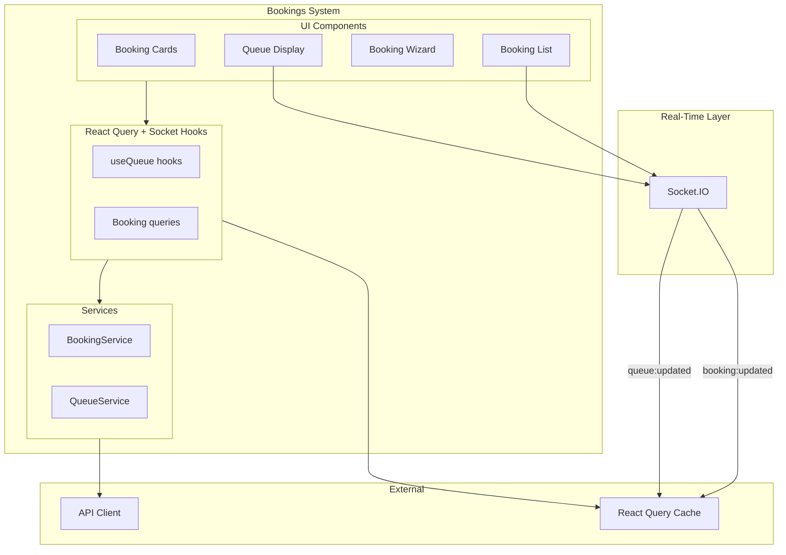
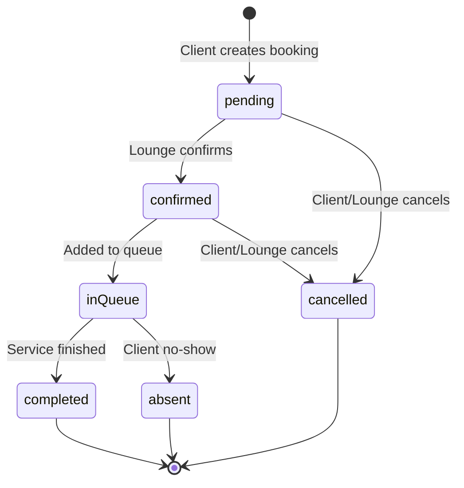
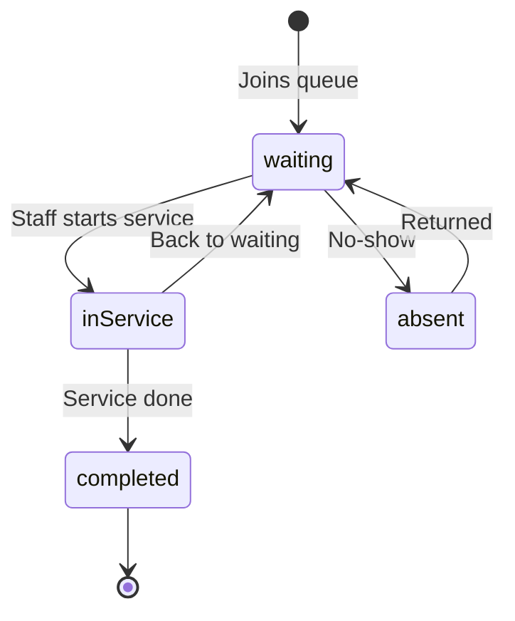
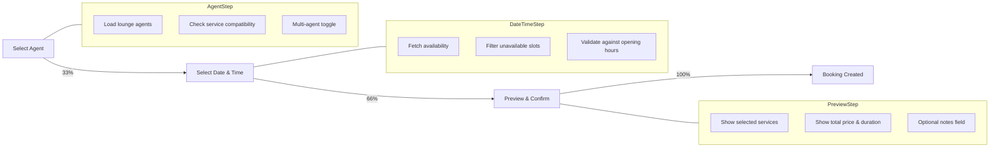
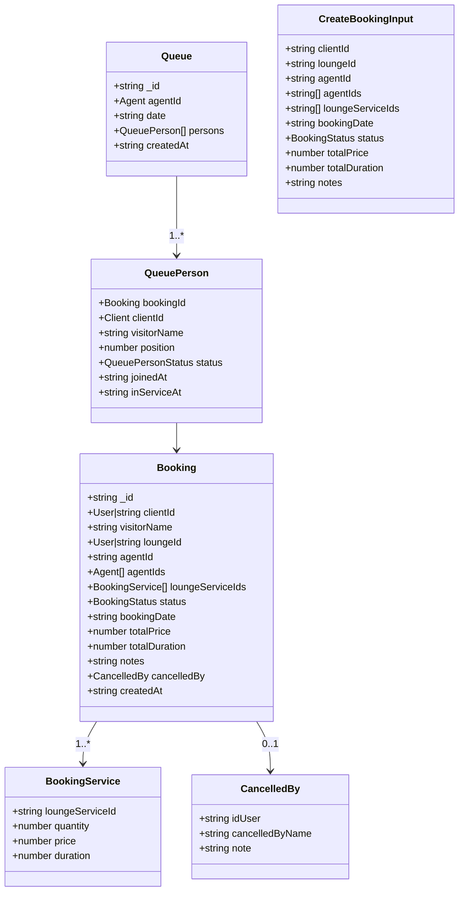
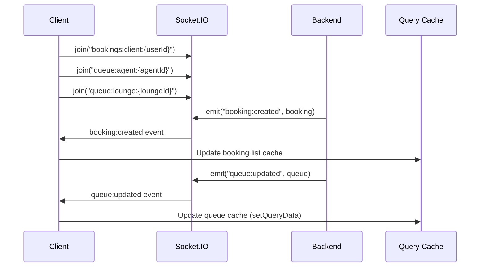
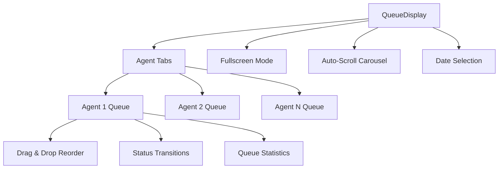
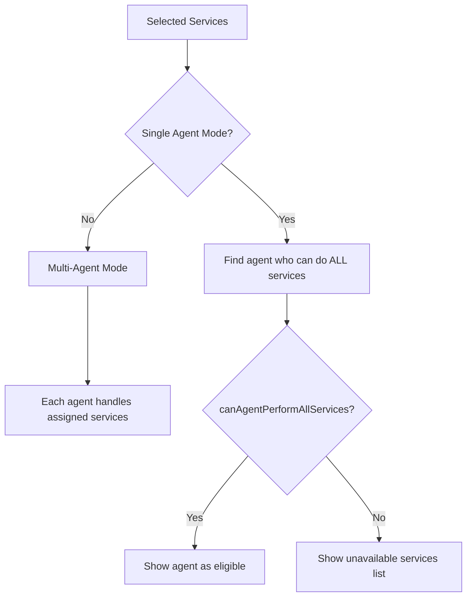

# Bookings System

The bookings system handles appointment scheduling, real-time queue management, and booking lifecycle for the Frame Beauty platform.

---

## Architecture Overview



---

## Booking Lifecycle



---

## Queue Person Status Flow



---

## Booking Wizard Flow



---

## Data Model



---

## Directory Structure

```
app/_systems/bookings/
├── index.ts
├── types/
│   ├── booking.ts                    Booking, CreateBookingInput, BookingStats
│   └── queue.ts                      Queue, QueuePerson, QueuePersonStatus
├── hooks/
│   └── useQueue.ts                   Queue queries + mutations + WebSocket
├── services/
│   ├── booking.service.ts            Booking CRUD + availability
│   └── queue.service.ts              Queue CRUD + reorder
└── components/
    ├── bookings/
    │   ├── card/
    │   │   ├── BookingCard.tsx        Main booking card
    │   │   ├── booking-avatar.tsx     Client/Lounge avatar
    │   │   ├── BookingActions.tsx     Status action buttons
    │   │   ├── BookingStatusBadge.tsx Colored status badge
    │   │   ├── BookingServicesList.tsx Service items display
    │   │   ├── BookingAgentInfo.tsx   Agent info section
    │   │   ├── BookingTotalSummary.tsx Price & duration totals
    │   │   ├── BookingLocationLink.tsx Map link
    │   │   ├── BookingQueueBanner.tsx Queue position banner
    │   │   ├── BookingSkeleton.tsx    Loading skeleton
    │   │   └── CancelBookingDialog.tsx Cancel with note modal
    │   ├── list/
    │   │   ├── booking-list.tsx       Real-time booking list
    │   │   ├── BookingHistory.tsx     History view
    │   │   └── BookingListHeader.tsx  Header with filters
    │   └── wizard/
    │       ├── booking-wizard.tsx     3-step booking wizard
    │       ├── booking-progress.tsx   Visual progress bar
    │       ├── booking-navigation.tsx Navigation buttons
    │       ├── booking-agent-step.tsx Agent selection step
    │       ├── booking-datetime-step.tsx Date/time picker step
    │       ├── booking-preview-step.tsx Preview & confirm step
    │       └── _lib/
    │           └── booking-wizard-utils.ts Agent-service compatibility
    └── queue/
        ├── queue-display.tsx          Main queue view (drag & drop)
        ├── queue-item.tsx             Single queue person card
        ├── queue-header.tsx           Queue header
        ├── queue-stats.tsx            Statistics display
        ├── queue-details.tsx          Detailed queue info
        ├── queue-utils.ts             Stats calculation helpers
        ├── queue-hooks.ts             Fullscreen & auto-scroll hooks
        ├── queue-agent-tabs.tsx       Agent tab navigation
        ├── add-to-queue-dialog.tsx    Add person dialog
        ├── book-from-queue-dialog.tsx Walk-in booking dialog
        ├── countdown-timer.tsx        Wait time countdown
        └── queue-loading-skeletons.tsx Loading states
```

---

## Booking Service API

| Method | Endpoint | Description |
|--------|----------|-------------|
| `create` | `POST /v1/bookings` | Create new booking |
| `getAll` | `GET /v1/bookings` | List user's bookings |
| `getHistory` | `GET /v1/bookings/history` | Past bookings |
| `getById` | `GET /v1/bookings/:id` | Single booking |
| `update` | `PUT /v1/bookings/:id` | Update status/details |
| `delete` | `DELETE /v1/bookings/:id` | Remove booking |
| `cancel` | `PATCH /v1/bookings/:id/cancel` | Cancel with note |
| `getBookingServices` | `GET /v1/bookings/:id/services` | Booking's services |
| `getClientStats` | `GET /v1/bookings/stats/client/:id` | Client booking stats |
| `getLoungeStats` | `GET /v1/bookings/stats/lounge/:id` | Lounge booking stats |
| `bookFromQueue` | `POST /v1/bookings/queue` | Walk-in booking |
| `loungeBookFromQueue` | `POST /v1/bookings/lounge-queue` | Lounge-initiated walk-in |
| `getAvailability` | `POST /v1/bookings/availability` | Agent availability slots |

---

## Queue Service API

| Method | Endpoint | Description |
|--------|----------|-------------|
| `getAgentQueue` | `GET /v1/queues/agent/:agentId` | Agent's queue for date |
| `getLoungeQueues` | `GET /v1/queues/lounge/:loungeId` | All queues for lounge |
| `getMyLoungeQueues` | `GET /v1/queues/my-lounge` | Owner's lounge queues |
| `addPersonToQueue` | `POST /v1/queues/agent/:id/persons` | Add person to queue |
| `updatePersonStatus` | `PUT /v1/queues/agent/:id/persons/:bookingId` | Change person status |
| `removePersonFromQueue` | `DELETE /v1/queues/agent/:id/persons/:bookingId` | Remove from queue |
| `reorderPerson` | `PUT /v1/queues/agent/:id/persons/:bookingId/reorder` | Change position |
| `populateDailyQueues` | `POST /v1/queues/populate` | Admin: create daily queues |

---

## Real-Time WebSocket Integration



### Socket Rooms & Events

| Room Pattern | Events | Description |
|--------------|--------|-------------|
| `bookings:client:{userId}` | `booking:created`, `booking:updated`, `booking:cancelled`, `booking:statusChanged` | Client booking updates |
| `bookings:lounge:{userId}` | Same as above | Lounge booking updates |
| `queue:agent:{agentId}` | `queue:updated` | Single agent queue changes |
| `queue:lounge:{loungeId}` | `queue:lounge:updated` | All queues for a lounge |

---

## Queue Display Features



### Queue Statistics Calculation

| Metric | Formula |
|--------|---------|
| `totalWaiting` | Count where `status === "waiting"` |
| `totalInService` | Count where `status === "inService"` |
| `totalCompleted` | Count where `status === "completed"` |
| `totalAbsent` | Count where `status === "absent"` |
| `averageWait` | Mean of `(now - joinedAt)` for waiting persons |
| `estimatedWaitTime` | Position × avg service time |

---

## Booking Error Codes

| Code | Description |
|------|-------------|
| `BOOKING_NOT_FOUND` | Booking ID does not exist |
| `BOOKING_ALREADY_CANCELLED` | Cannot cancel twice |
| `BOOKING_ALREADY_COMPLETED` | Cannot modify completed booking |
| `AGENT_NOT_AVAILABLE` | Agent has conflicting booking |
| `INVALID_BOOKING_DATE` | Date in the past or invalid |
| `SERVICE_NOT_FOUND` | Referenced service does not exist |

---

## Booking Wizard Agent-Service Compatibility



Utility functions:
- `canAgentPerformAllServices(agent, services)` — checks `agent.idLoungeService` contains all selected service IDs
- `getUnavailableServices(agent, services)` — returns services the agent cannot perform
- `getAvailableAgentsForService(agents, serviceId)` — filters agents who can do a specific service
