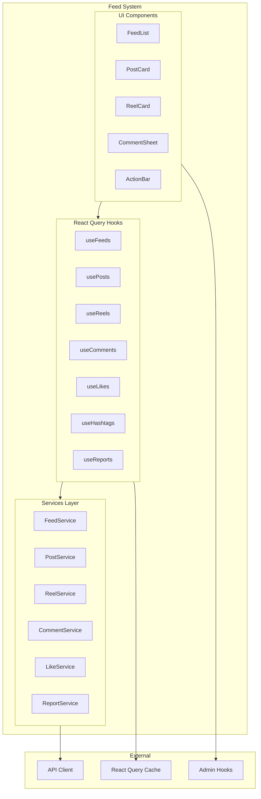
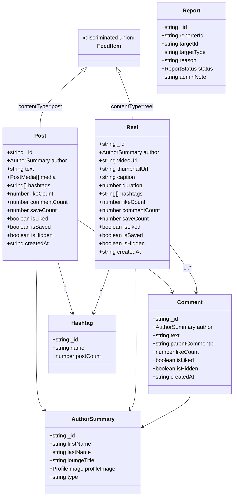
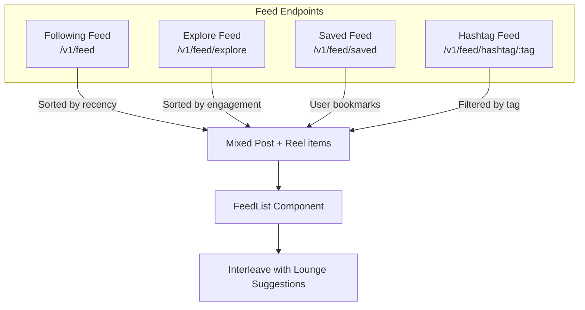
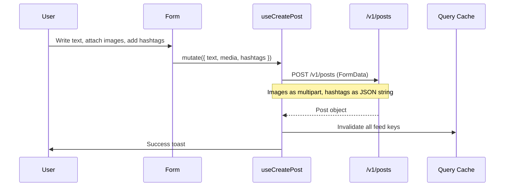
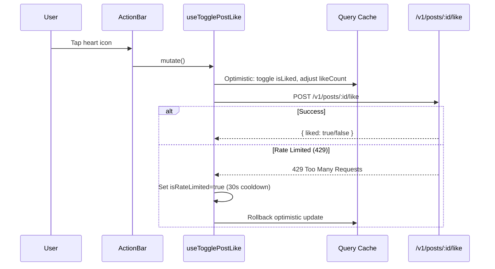
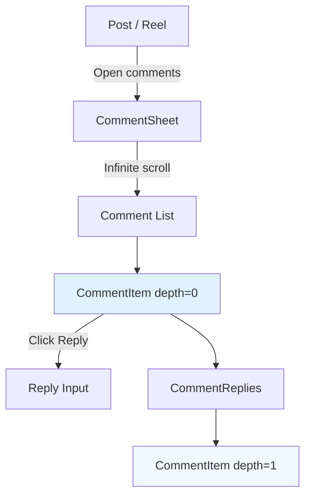
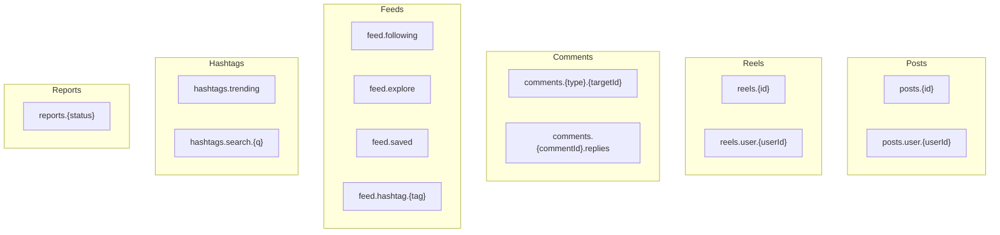
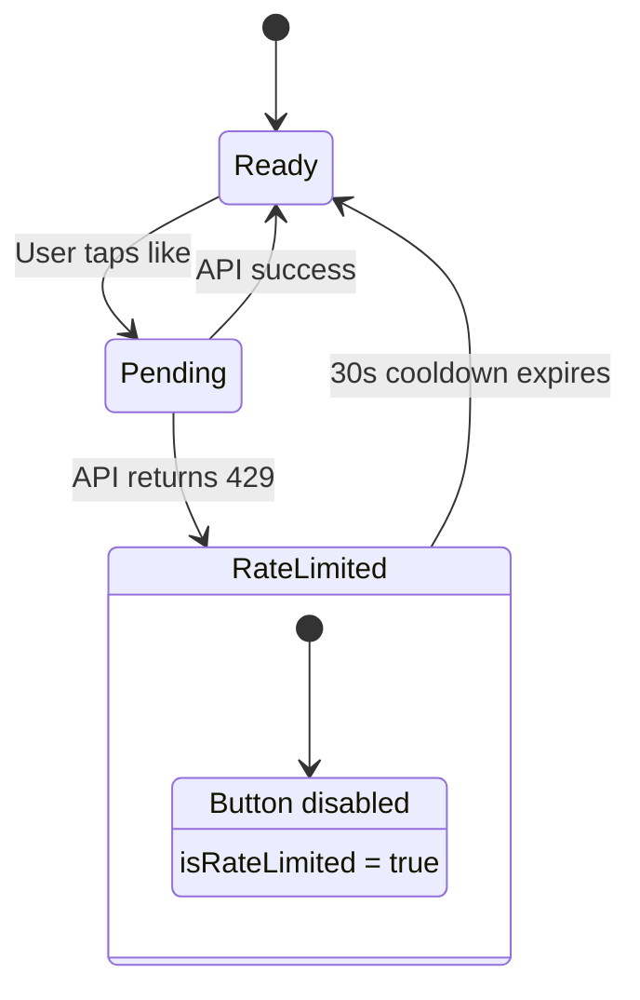

# Feed System

The feed system powers the social content layer of Frame Beauty — posts, reels, comments, hashtags, likes, saves, and content moderation.

---

## Architecture Overview



---

## Content Data Model



---

## Feed Types & Flows



### Feed Interleaving Algorithm

The `FeedList` component interleaves content for variety:
1. Separates posts and reels from the feed items
2. Uses `hashCode(postId)` as a deterministic seed for stable placement
3. Inserts reel cards and lounge suggestion cards at pseudo-random intervals
4. Deduplicates items across pages using a `Set`
5. Renders via Intersection Observer infinite scroll

---

## Post Lifecycle



---

## Like & Save (Optimistic Updates)



The `updateFeedItemOptimistic` helper updates the item across **all** feed caches (following, explore, saved, hashtag) in a single pass.

---

## Comment System



**Nesting**: Single level only — `parentCommentId` must reference a top-level comment. Replies are displayed indented 40px under their parent.

### Comment Sheet Features
- Bottom-sheet overlay (mobile full-height, desktop side panel)
- Infinite scroll with sentinel ref
- Reply-to context header ("Replying to @name")
- Highlight & auto-scroll to specific comment (from notification deep-link)
- Locks body scroll, hides mobile navbar while open

---

## Directory Structure

```
app/_systems/feed/
├── index.ts                              Barrel exports
├── types/
│   ├── content.ts                        Post, Reel, FeedItem, Comment, Report, DTOs
│   ├── post.ts                           Re-exports from content.ts
│   └── like.ts                           Lounge-specific like types
├── services/
│   ├── feed.service.ts                   Feed endpoints (following, explore, saved, hashtag)
│   ├── post.service.ts                   Post CRUD + like/save/admin
│   ├── reel.service.ts                   Reel CRUD + like/save/admin
│   ├── comment.service.ts               Comment CRUD + like/admin
│   ├── like.service.ts                   Lounge likes (client→lounge)
│   └── report.service.ts                Content reporting + admin review
├── hooks/
│   ├── content-keys.ts                   Query key factory + helpers
│   ├── useFeeds.ts                       Infinite feed queries
│   ├── usePosts.ts                       Post queries + mutations
│   ├── useReels.ts                       Reel queries + mutations
│   ├── useComments.ts                    Comment queries + mutations
│   ├── useLikes.ts                       Lounge like queries + mutations
│   ├── useHashtags.ts                    Trending + search hashtag queries
│   ├── useReports.ts                     Report mutations + admin queries
│   └── useContent.ts                     Barrel re-export
└── components/
    └── content/
        ├── feed-list.tsx                  Interleaved infinite feed
        ├── post-card.tsx                  Full post display with actions
        ├── reel-card.tsx                  Reel thumbnail grid card
        ├── action-bar.tsx                 Like/comment/share/save buttons
        ├── author-header.tsx              Author avatar + name + time
        ├── comment-sheet.tsx              Bottom-sheet comment panel
        ├── comment-input.tsx              Comment text input
        ├── comment-item.tsx               Single comment with replies
        ├── reel-swiper.tsx                Horizontal reel carousel
        └── ... (31 component files total)
```

---

## API Endpoints

### Feed Service

| Method | Endpoint | Description |
|--------|----------|-------------|
| `getFollowingFeed` | `GET /v1/feed?page&limit` | Posts from followed users |
| `getExploreFeed` | `GET /v1/feed/explore?page&limit` | Global discover feed |
| `getSavedFeed` | `GET /v1/feed/saved?page&limit` | User's bookmarked content |
| `getHashtagFeed` | `GET /v1/feed/hashtag/:tag?page&limit` | Content with specific hashtag |
| `getTrendingHashtags` | `GET /v1/feed/hashtags/trending?limit` | Trending hashtags |
| `searchHashtags` | `GET /v1/feed/hashtags/search?q&limit` | Search by partial match |

### Post Service

| Method | Endpoint | Description |
|--------|----------|-------------|
| `createPost` | `POST /v1/posts` | Create post (FormData) |
| `getPost` | `GET /v1/posts/:id` | Single post detail |
| `getUserPosts` | `GET /v1/posts/user/:userId` | User's posts (paginated) |
| `updatePost` | `PUT /v1/posts/:id` | Edit text/hashtags |
| `deletePost` | `DELETE /v1/posts/:id` | Remove post |
| `toggleLike` | `POST /v1/posts/:id/like` | Toggle like |
| `toggleSave` | `POST /v1/posts/:id/save` | Toggle save/bookmark |
| `hidePost` | `PATCH /v1/admin/posts/:id/hide` | Admin: hide from feeds |
| `unhidePost` | `PATCH /v1/admin/posts/:id/unhide` | Admin: restore visibility |
| `adminDeletePost` | `DELETE /v1/admin/posts/:id` | Admin: force delete |

### Reel Service

| Method | Endpoint | Description |
|--------|----------|-------------|
| `createReel` | `POST /v1/reels` | Create reel (FormData) |
| `getReel` | `GET /v1/reels/:id` | Single reel detail |
| `getUserReels` | `GET /v1/reels/user/:userId` | User's reels (paginated) |
| `deleteReel` | `DELETE /v1/me/reels/:id` | Owner delete |
| `toggleLike` | `POST /v1/reels/:id/like` | Toggle like |
| `toggleSave` | `POST /v1/reels/:id/save` | Toggle save |

### Comment Service

| Method | Endpoint | Description |
|--------|----------|-------------|
| `addComment` | `POST /v1/{type}s/:id/comments` | Add comment or reply |
| `getComments` | `GET /v1/{type}s/:id/comments` | Top-level comments |
| `getReplies` | `GET /v1/comments/:id/replies` | Replies to a comment |
| `deleteComment` | `DELETE /v1/comments/:id` | Remove comment |
| `toggleLike` | `POST /v1/comments/:id/like` | Toggle comment like |

### Lounge Like Service

| Method | Endpoint | Description |
|--------|----------|-------------|
| `toggle` | `POST /v1/likes/lounge/:id` | Toggle lounge like |
| `checkLiked` | `GET /v1/likes/lounge/:id/check` | Check if liked |
| `getMyLikes` | `GET /v1/likes/me` | User's liked lounges |
| `getLoungeLikers` | `GET /v1/likes/lounge/:id/likers` | Who liked a lounge |

---

## Query Key Factory



---

## Rate Limiting Strategy

All toggle mutations (like, save) implement a 30-second client-side cooldown on 429 responses:



---

## Post Card Features

| Feature | Description |
|---------|-------------|
| Double-tap-to-like | Heart animation overlay |
| Text truncation | 150 chars max, "more" expander |
| Hashtag rendering | Clickable `<HashtagText>` links |
| Image carousel | Swipeable multi-image gallery |
| Content menu | Edit (owner), Delete (owner), Report (others), Hide/Unhide (admin) |
| Admin badge | "Hidden from public feeds" indicator |
| Optimistic UI | Instant like/save visual feedback |
