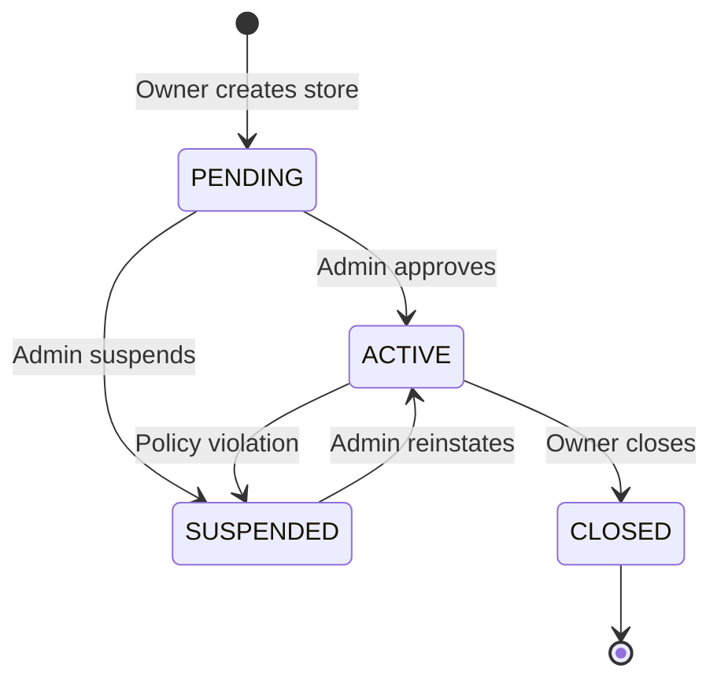
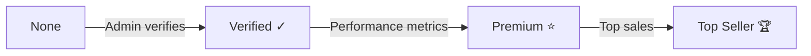
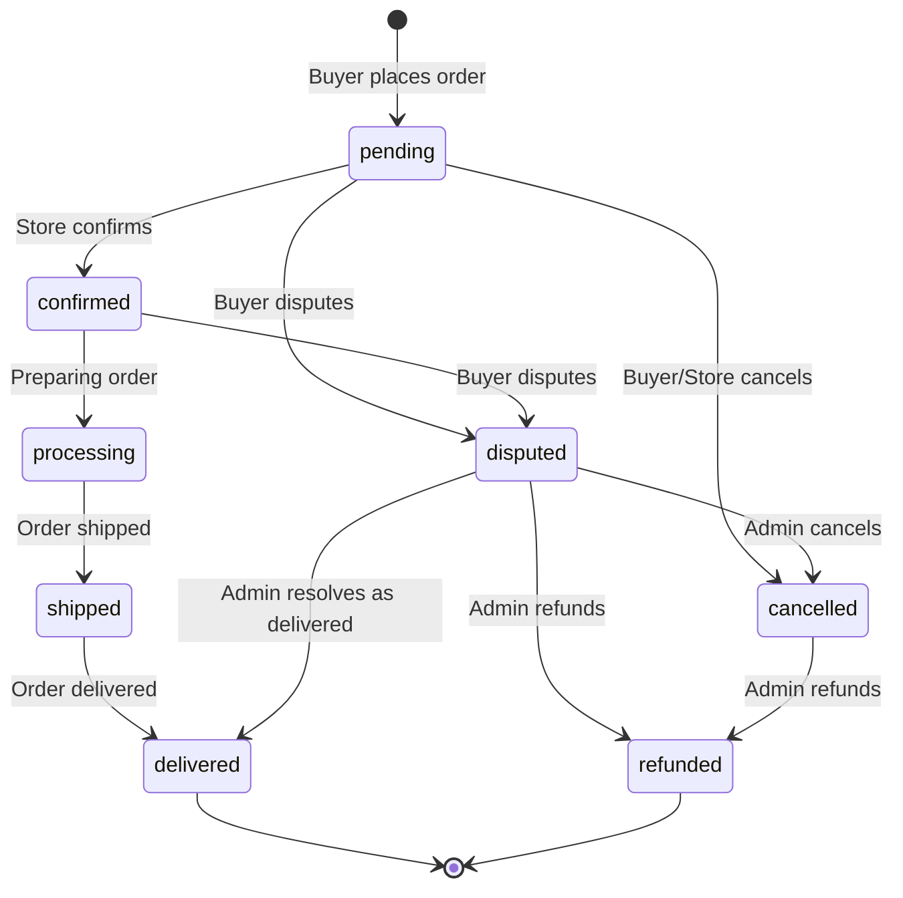
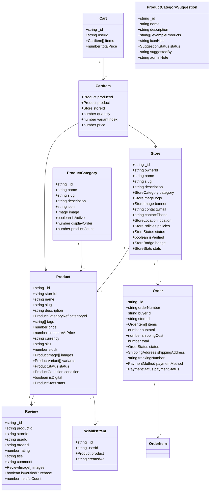
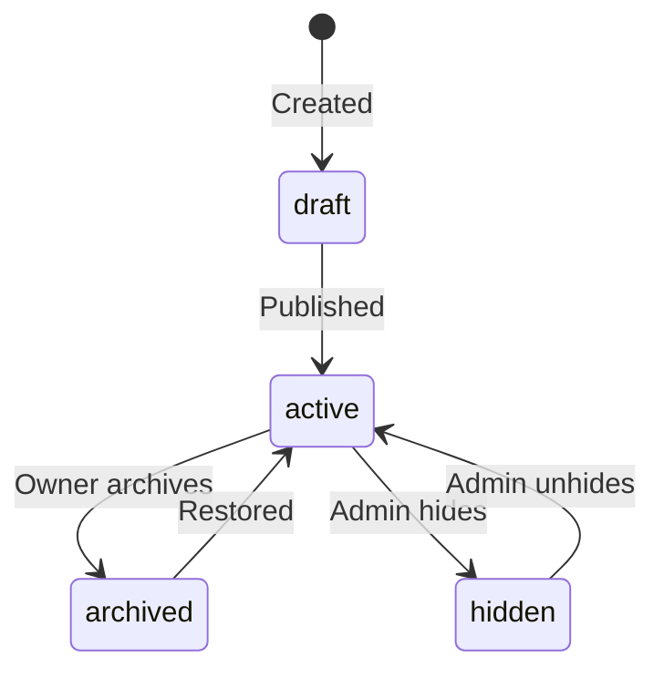
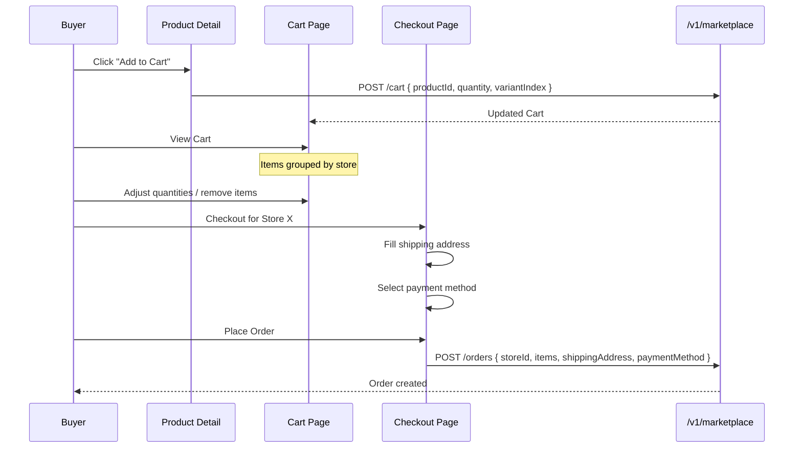
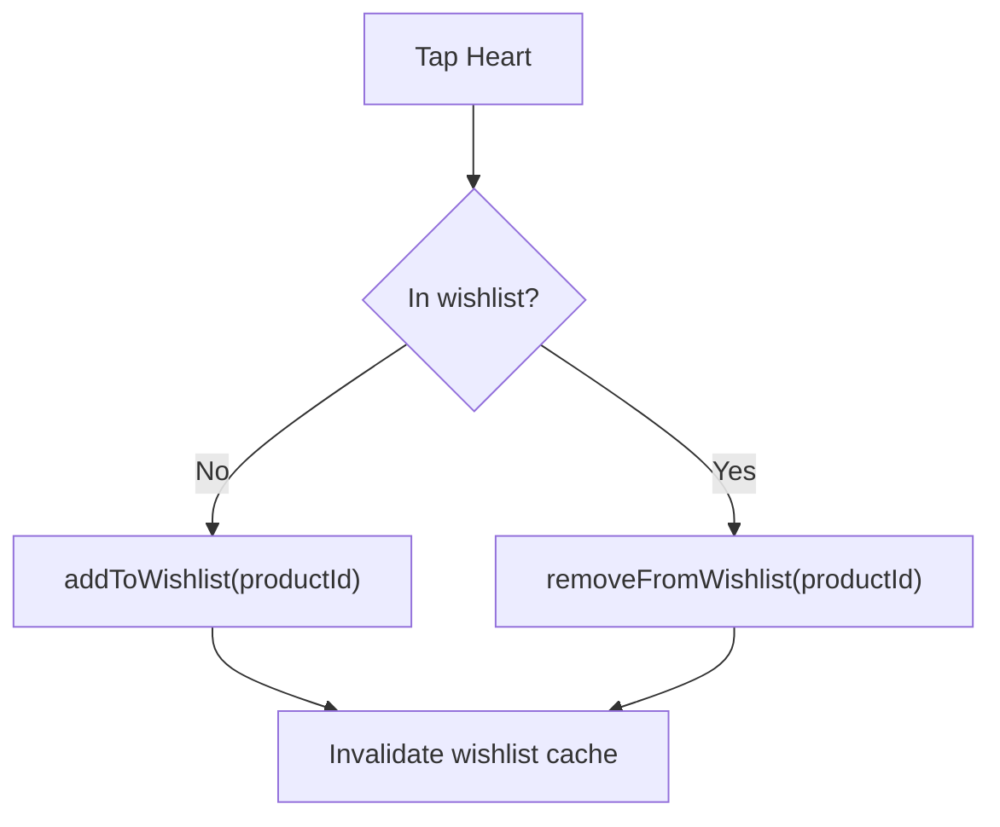
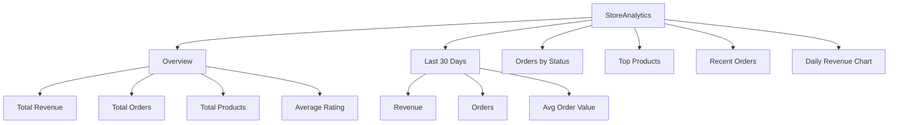
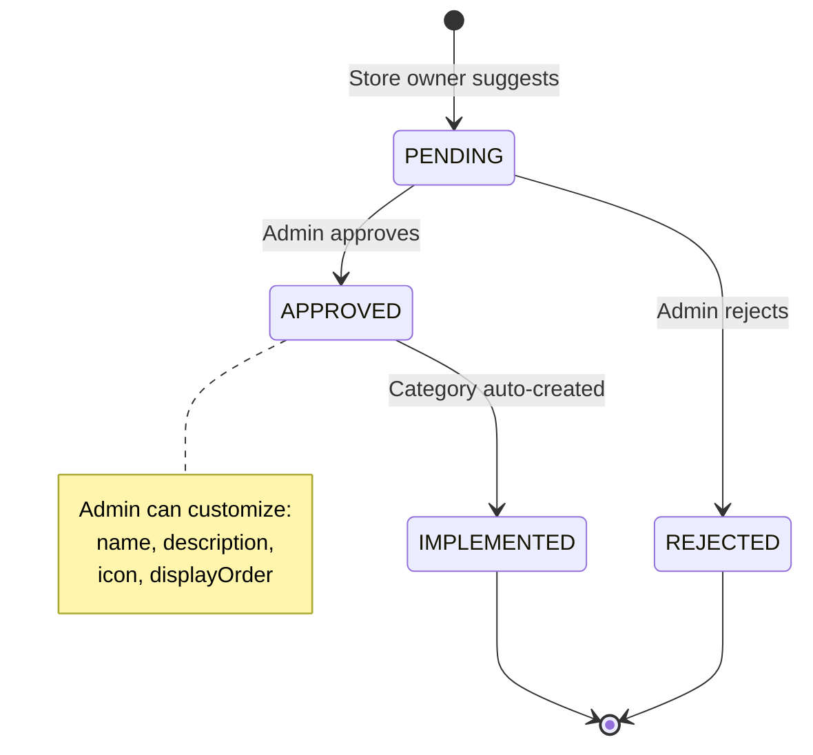

# Marketplace System

The marketplace system powers the e-commerce layer of Frame Beauty — stores, products, orders, cart, reviews, wishlists, and product category management.

---

## Architecture Overview

```mermaid
graph TB
    subgraph MarketplaceSystem["Marketplace System"]
        subgraph Core["Core"]
            MS[MarketplaceService]
            MT[Types]
        end

        subgraph Hooks["React Query Hooks"]
            UMP[useMarketplace hooks]
        end

        subgraph Components["UI Components"]
            PC[ProductCard]
            SC[StoreCard]
            CI[CartItem]
            OC[OrderCard]
            RC[ReviewCard]
            WB[WishlistButton]
        end

        subgraph Pages["Route Pages"]
            DISC[/store - Discover]
            PROD[/store/products/:id]
            CART[/store/cart]
            CHK[/store/checkout/:storeId]
            ORD[/store/orders]
            MYSTORE[/store/my-store]
        end
    end

    subgraph External
        API[API Client /v1/marketplace]
        QC[React Query Cache]
    end

    MS --> API
    UMP --> MS
    UMP --> QC
    Components --> UMP
    Pages --> Components
```

---

## Store Lifecycle



### Store Badge Levels



---

## Order Flow



---

## Data Model



---

## Directory Structure

```
app/_systems/marketplace/
├── index.ts                           Re-exports service, types, hooks
├── service.ts                         MarketplaceService class (80+ methods)
├── types.ts                           All types, interfaces, DTOs, enums
├── hooks/
│   └── useMarketplace.ts              All React Query hooks
└── components/
    ├── cart-item.tsx                   Cart row (image, price, qty controls)
    ├── cart-store-group.tsx            Cart items grouped by store
    ├── category-picker.tsx            Category selection (re-export)
    ├── discover-filters.tsx           Discovery filters (re-export)
    ├── image-uploader.tsx             Drag-drop image upload
    ├── order-card.tsx                 Order summary card
    ├── order-timeline.tsx             Visual order status timeline
    ├── price-display.tsx              Price with optional strikethrough
    ├── product-card.tsx               Product card with wishlist/cart
    ├── product-gallery.tsx            Multi-image gallery with thumbnails
    ├── product-variants.tsx           Variant selector (size, color)
    ├── review-card.tsx                Review display with stars
    ├── review-form.tsx                Rating + review submission
    ├── stock-indicator.tsx            Stock availability badge
    ├── store-card.tsx                 Store discovery card
    ├── store-header.tsx               Store profile header
    ├── suggest-category-modal.tsx     Category suggestion form
    └── wishlist-button.tsx            Wishlist toggle heart icon

app/store/                             Route pages
├── page.tsx                           Store discovery
├── cart/page.tsx                      Shopping cart
├── checkout/[storeId]/page.tsx        Per-store checkout
├── my-store/
│   ├── page.tsx                       Store dashboard
│   ├── create/page.tsx                Create store
│   ├── edit/page.tsx                  Edit store settings
│   ├── analytics/page.tsx             Store analytics
│   ├── orders/page.tsx                Manage orders
│   ├── products/
│   │   ├── page.tsx                   Product list
│   │   ├── new/page.tsx               Create product
│   │   └── edit/[id]/page.tsx         Edit product
│   └── suggestions/page.tsx           Category suggestions
├── orders/
│   ├── page.tsx                       My orders
│   └── [id]/page.tsx                  Order detail
├── products/
│   ├── page.tsx                       Product discovery
│   └── [id]/page.tsx                  Product detail
├── stores/
│   ├── page.tsx                       Store listing
│   └── [slug]/page.tsx                Store profile
└── wishlist/page.tsx                  Wishlist page
```

---

## MarketplaceService API (80+ Methods)

### Stores

| Method | Endpoint | Description |
|--------|----------|-------------|
| `discoverStores` | `GET /v1/marketplace/stores/discover` | Paginated with filters |
| `getStoreBySlug` | `GET /v1/marketplace/stores/slug/:slug` | Store by slug |
| `getStoreById` | `GET /v1/marketplace/stores/:id` | Store by ID |
| `createStore` | `POST /v1/marketplace/stores` | Create new store |
| `getMyStore` | `GET /v1/marketplace/stores/me` | Current user's store |
| `updateMyStore` | `PUT /v1/marketplace/stores/me` | Update store |
| `uploadStoreLogo` | `POST /v1/marketplace/stores/me/logo` | Upload logo |
| `uploadStoreBanner` | `POST /v1/marketplace/stores/me/banner` | Upload banner |
| `closeMyStore` | `DELETE /v1/marketplace/stores/me` | Close store |

### Products

| Method | Endpoint | Description |
|--------|----------|-------------|
| `discoverProducts` | `GET /v1/marketplace/products/discover` | Search, filter, sort |
| `getProductsByStore` | `GET /v1/marketplace/products/store/:id` | Products by store |
| `getProductById` | `GET /v1/marketplace/products/:id` | Product detail |
| `createProduct` | `POST /v1/marketplace/products` | Create product |
| `updateProduct` | `PUT /v1/marketplace/products/:id` | Update product |
| `uploadProductImages` | `POST /v1/marketplace/products/:id/images` | Upload images |
| `deleteProductImage` | `DELETE /v1/marketplace/products/:id/images/:publicId` | Remove image |
| `deleteProduct` | `DELETE /v1/marketplace/products/:id` | Delete product |

### Orders

| Method | Endpoint | Description |
|--------|----------|-------------|
| `createOrder` | `POST /v1/marketplace/orders` | Place order |
| `getMyOrders` | `GET /v1/marketplace/orders/me` | Buyer's orders |
| `getOrderById` | `GET /v1/marketplace/orders/:id` | Order detail |
| `getStoreOrders` | `GET /v1/marketplace/orders/store/:id` | Store's orders |
| `getMyStoreOrders` | `GET /v1/marketplace/orders/my-store/:id` | Owner's orders |
| `updateOrderStatus` | `PATCH /v1/marketplace/orders/:id/status` | Update status |

### Cart

| Method | Endpoint | Description |
|--------|----------|-------------|
| `getCart` | `GET /v1/marketplace/cart` | User's cart |
| `addToCart` | `POST /v1/marketplace/cart` | Add item |
| `updateCartItem` | `PUT /v1/marketplace/cart/:productId` | Update quantity |
| `removeFromCart` | `DELETE /v1/marketplace/cart/:productId` | Remove item |
| `clearCart` | `DELETE /v1/marketplace/cart` | Clear all items |

### Reviews

| Method | Endpoint | Description |
|--------|----------|-------------|
| `getProductReviews` | `GET /v1/marketplace/reviews/product/:id` | Product reviews |
| `getStoreReviews` | `GET /v1/marketplace/reviews/store/:id` | Store reviews |
| `createReview` | `POST /v1/marketplace/reviews` | Submit review |
| `updateReview` | `PUT /v1/marketplace/reviews/:id` | Edit review |
| `deleteReview` | `DELETE /v1/marketplace/reviews/:id` | Delete review |
| `markReviewHelpful` | `POST /v1/marketplace/reviews/:id/helpful` | Mark helpful |

### Wishlist

| Method | Endpoint | Description |
|--------|----------|-------------|
| `getWishlist` | `GET /v1/marketplace/wishlist` | User's wishlist |
| `addToWishlist` | `POST /v1/marketplace/wishlist` | Add product |
| `removeFromWishlist` | `DELETE /v1/marketplace/wishlist/:productId` | Remove product |

### Product Categories

| Method | Endpoint | Description |
|--------|----------|-------------|
| `listProductCategories` | `GET /v1/marketplace/product-categories` | Category list |
| `searchProductCategories` | `GET /v1/marketplace/product-categories/search?q=` | Search |
| `getProductCategoryById` | `GET /v1/marketplace/product-categories/:id` | By ID |
| `adminCreateProductCategory` | `POST /v1/admin/marketplace/product-categories` | Create |
| `adminUpdateProductCategory` | `PUT /v1/admin/marketplace/product-categories/:id` | Update |
| `adminDeleteProductCategory` | `DELETE /v1/admin/marketplace/product-categories/:id` | Delete |

### Category Suggestions

| Method | Endpoint | Description |
|--------|----------|-------------|
| `listProductCategorySuggestions` | `GET /v1/marketplace/product-category-suggestions` | List |
| `getProductCategorySuggestionStats` | `GET /v1/marketplace/product-category-suggestions/stats` | Stats |
| `createProductCategorySuggestion` | `POST /v1/marketplace/product-category-suggestions` | Submit |
| `adminApproveProductCategorySuggestion` | `POST /v1/admin/marketplace/product-category-suggestions/:id/approve` | Approve + auto-create category |
| `adminUpdateProductCategorySuggestionStatus` | `PATCH /v1/admin/marketplace/product-category-suggestions/:id/status` | Update status |

### Admin

| Method | Endpoint | Description |
|--------|----------|-------------|
| `adminGetAllStores` | `GET /v1/admin/marketplace/stores` | All stores |
| `adminUpdateStoreStatus` | `PATCH /v1/admin/marketplace/stores/:id/status` | Update store status |
| `adminVerifyStore` | `PATCH /v1/admin/marketplace/stores/:id/verify` | Verify + badge |
| `adminGetAllProducts` | `GET /v1/admin/marketplace/products` | All products |
| `adminUpdateProductStatus` | `PATCH /v1/admin/marketplace/products/:id/status` | Update product status |
| `adminGetAllOrders` | `GET /v1/admin/marketplace/orders` | All orders |
| `adminResolveDispute` | `PATCH /v1/admin/marketplace/orders/:id/resolve` | Resolve dispute |
| `adminHideReview` | `PATCH /v1/admin/marketplace/reviews/:id/hide` | Hide review |
| `adminGetAnalytics` | `GET /v1/admin/marketplace/analytics` | Admin analytics |

---

## Enums & Constants

### Store Categories
`beauty` · `fashion` · `wellness` · `accessories` · `tools` · `other`

### Product Status Flow



### Product Conditions
`new` · `likeNew` · `used`

### Payment Methods
`cashOnDelivery` · `bankTransfer` · `inStore`

### Payment Statuses
`pending` · `paid` · `refunded` · `failed`

---

## Cart & Checkout Flow



---

## Wishlist Toggle



---

## Product Discovery Filters

| Parameter | Type | Options |
|-----------|------|---------|
| `search` | string | Free text search |
| `categoryId` | string | Product category filter |
| `storeId` | string | Store filter |
| `minPrice` | number | Minimum price |
| `maxPrice` | number | Maximum price |
| `inStock` | boolean | Only in-stock items |
| `sort` | enum | `newest`, `price_asc`, `price_desc`, `rating`, `popular`, `best_selling` |
| `page` | number | Pagination page |
| `limit` | number | Items per page |

---

## Store Analytics



---

## Category Suggestion Flow



When a suggestion is approved, the backend auto-creates a `ProductCategory` document and links it to the suggestion via `implementedCategoryId`.
