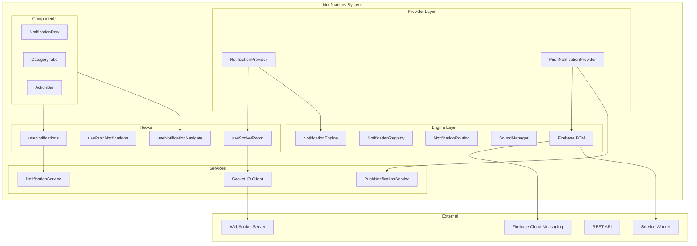
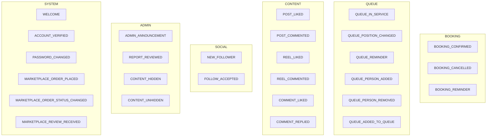
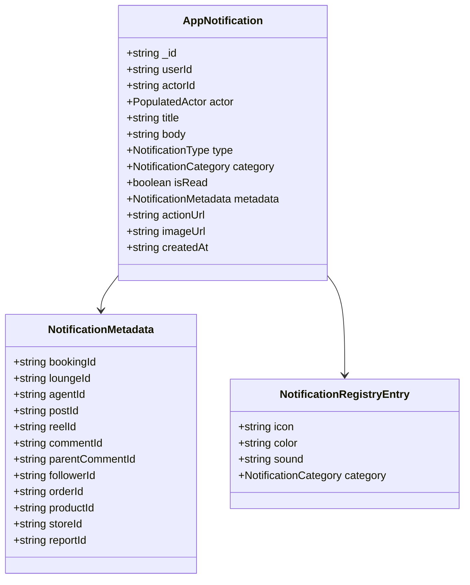
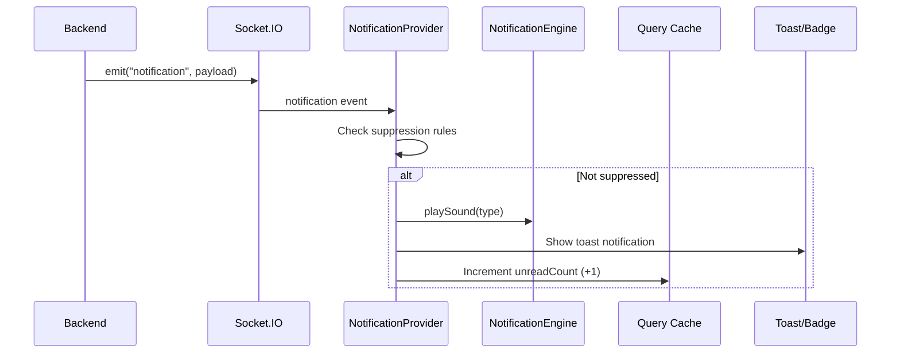
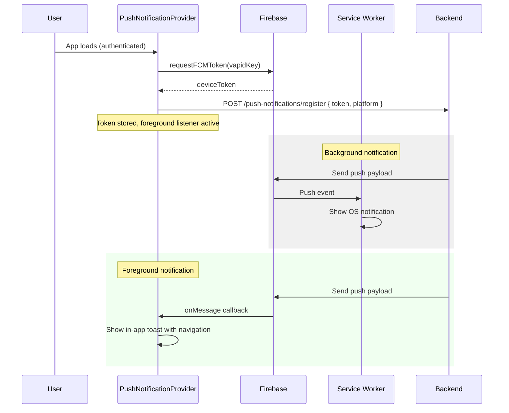
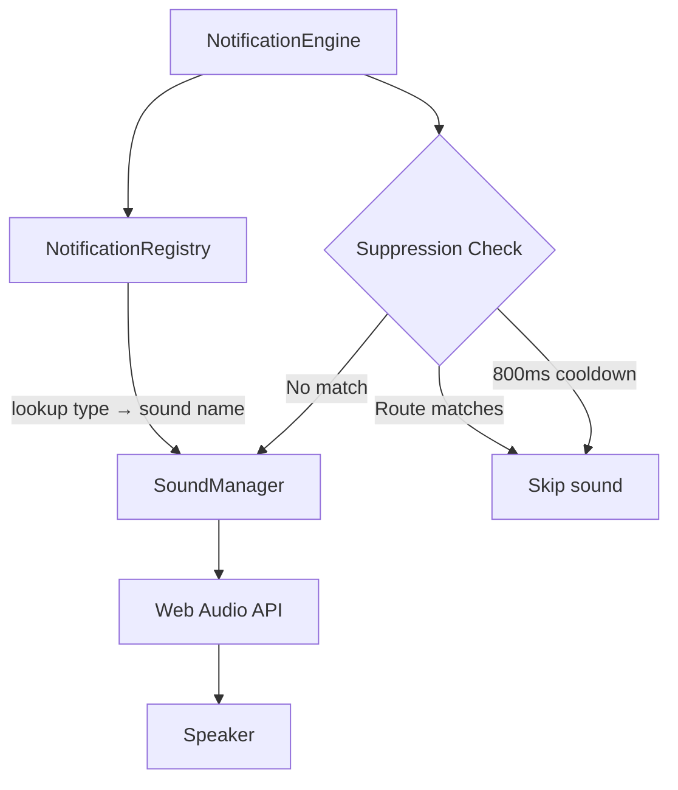
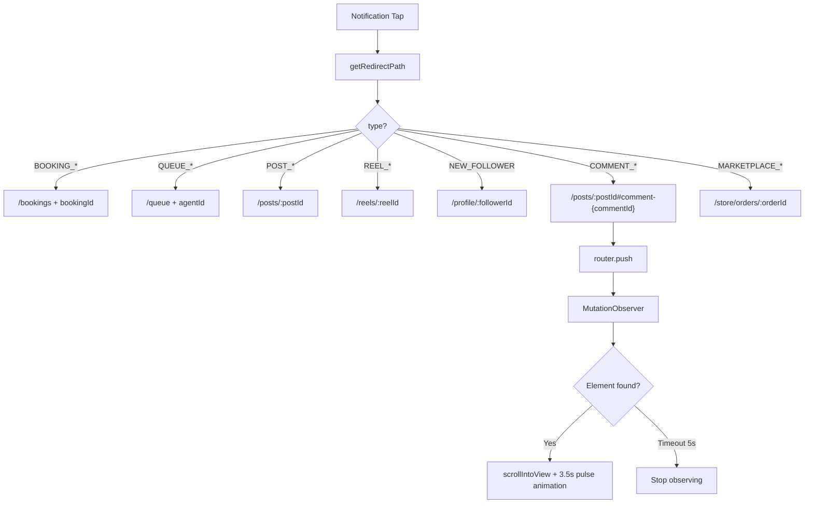
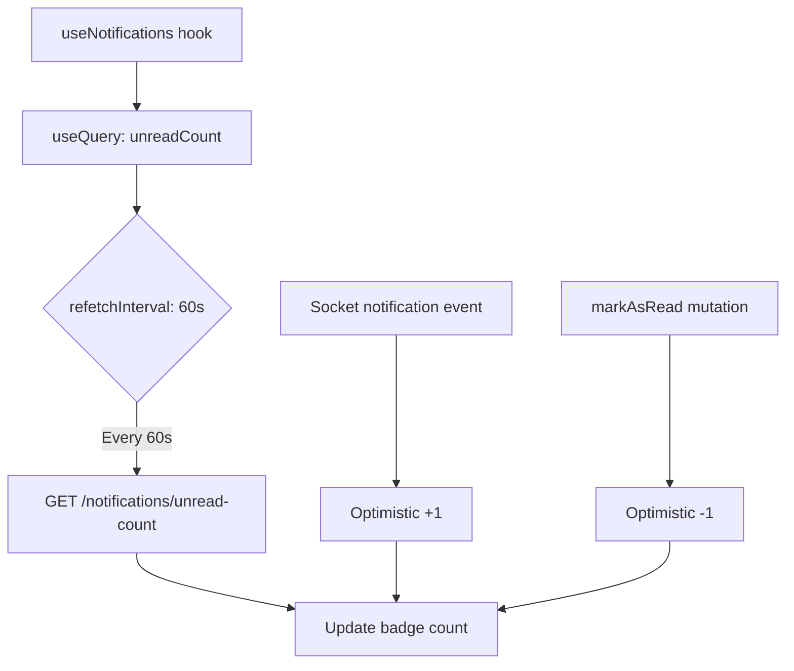

# Notifications System

The notifications system delivers real-time in-app notifications, push notifications (FCM), sound alerts, and deep-link navigation across Frame Beauty.

---

## Architecture Overview



---

## Notification Categories & Types



---

## Data Model



---

## Directory Structure

```
app/_systems/notifications/
├── index.ts
├── types/
│   └── notification.ts                All types, enums, DTOs
├── services/
│   ├── notification.service.ts        REST: getAll, markRead, delete
│   ├── push-notification.service.ts   FCM token register/unregister
│   └── socket.ts                      Socket.IO client singleton
├── lib/
│   ├── firebase.ts                    FCM initialization + token request
│   ├── notification-engine.ts         Sound playback + suppression
│   ├── notification-registry.ts       27 types → icon/color/sound map
│   ├── notification-routing.ts        Deep-link URL + scroll targets
│   ├── sound-manager.ts              Web Audio API (11 sounds)
│   └── time-utils.ts                 timeAgo formatting
├── hooks/
│   ├── useNotifications.ts           Unread count + infinite list
│   ├── useNotificationNavigate.ts    Deep-link navigation
│   ├── usePushNotifications.ts       FCM subscribe/foreground toast
│   └── useSocketRoom.ts             Socket room join/leave/events
├── providers/
│   ├── notification.tsx              Socket-based real-time provider
│   └── push-notification.tsx         FCM registration provider
└── components/
    ├── notification-action-bar.tsx    Mark all read, clear all
    ├── notification-category-tabs.tsx Horizontal scroll category tabs
    ├── notification-row.tsx           Single notification display
    ├── notification-empty-state.tsx   No notifications placeholder
    └── notification-unauth-state.tsx  Login prompt
```

---

## Notification API Endpoints

| Method | Endpoint | Description |
|--------|----------|-------------|
| `getAll` | `GET /v1/notifications?page&limit&category` | Paginated, filterable |
| `getUnreadCount` | `GET /v1/notifications/unread-count` | Total unread number |
| `markAsRead` | `PATCH /v1/notifications/:id/read` | Mark single as read |
| `delete` | `DELETE /v1/notifications/:id` | Delete single |
| `deleteAll` | `DELETE /v1/notifications` | Clear all |
| `registerToken` | `POST /v1/push-notifications/register` | Register FCM device token |
| `unregisterToken` | `POST /v1/push-notifications/unregister` | Unregister FCM token |

---

## Real-Time Notification Flow



### Socket Rooms

| Room | Joined When | Events |
|------|-------------|--------|
| `notifications:{userId}` | User authenticated | `notification` |
| `queue:agent:{agentId}` | Queue view open | `queue:updated` |
| `queue:lounge:{loungeId}` | Queue view open | `queue:lounge:updated` |

---

## Push Notification Flow (FCM)



---

## Sound System



### Available Sounds (11)

| Sound File | Used For |
|------------|----------|
| `notification-default.mp3` | Generic notifications |
| `notification-booking.mp3` | Booking confirmations |
| `notification-queue.mp3` | Queue updates |
| `notification-like.mp3` | Likes |
| `notification-comment.mp3` | Comments/replies |
| `notification-follow.mp3` | New followers |
| `notification-order.mp3` | Marketplace orders |
| `notification-message.mp3` | Messages |
| `notification-success.mp3` | Success feedback |
| `notification-warning.mp3` | Warnings |
| `notification-admin.mp3` | Admin announcements |

All sounds are preloaded via `AudioContext` on first user interaction and cached as `AudioBuffer` objects.

---

## Route-Based Suppression

Notifications are suppressed when the user is already viewing related content:

| Route Prefix | Suppressed Types |
|--------------|------------------|
| `/bookings` | `booking:*` |
| `/queue` | `queue:*` |
| `/posts` | `post:*` |
| `/reels` | `reel:*` |
| `/notifications` | All types |

---

## Deep-Link Navigation



The `useNotificationNavigate` hook:
1. Calls `getRedirectPath(notification)` for the URL
2. Calls `getTargetElementId(notification)` for the scroll target
3. Pushes the route via `router.push`
4. Starts a `MutationObserver` watching for the target element
5. When found, scrolls into view with `scrollAndHighlight` (3.5s pulse CSS animation)

---

## High-Priority Notification Types

These types show an **8-second** toast instead of the default duration:

- `QUEUE_IN_SERVICE`
- `QUEUE_REMINDER`
- `QUEUE_POSITION_CHANGED`

---

## Notification Registry Mapping (excerpt)

| Type | Icon | Color | Sound | Category |
|------|------|-------|-------|----------|
| `BOOKING_CONFIRMED` | CalendarCheck | green | booking | BOOKING |
| `QUEUE_IN_SERVICE` | UserCheck | blue | queue | QUEUE |
| `POST_LIKED` | Heart | red | like | CONTENT |
| `NEW_FOLLOWER` | UserPlus | purple | follow | SOCIAL |
| `ADMIN_ANNOUNCEMENT` | Megaphone | orange | admin | ADMIN |
| `MARKETPLACE_ORDER_PLACED` | ShoppingBag | green | order | SYSTEM |

---

## Unread Count Polling



The unread count combines:
- **Polling**: 60-second `refetchInterval` as a safety net
- **Socket**: Optimistic `+1` on each `notification` event
- **User action**: Optimistic `-1` on mark-as-read
