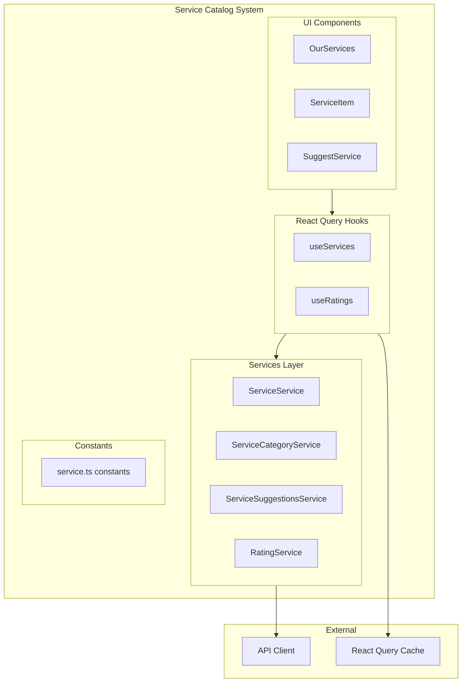
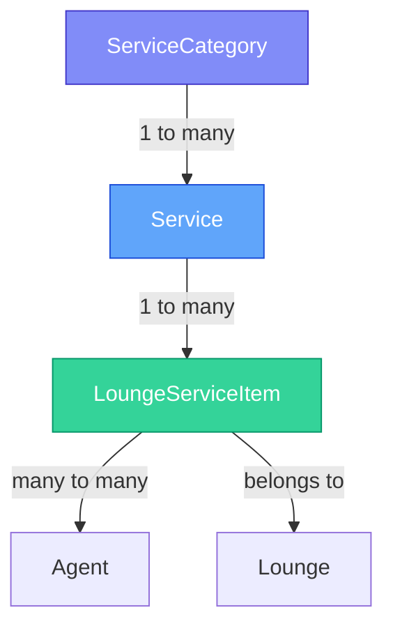
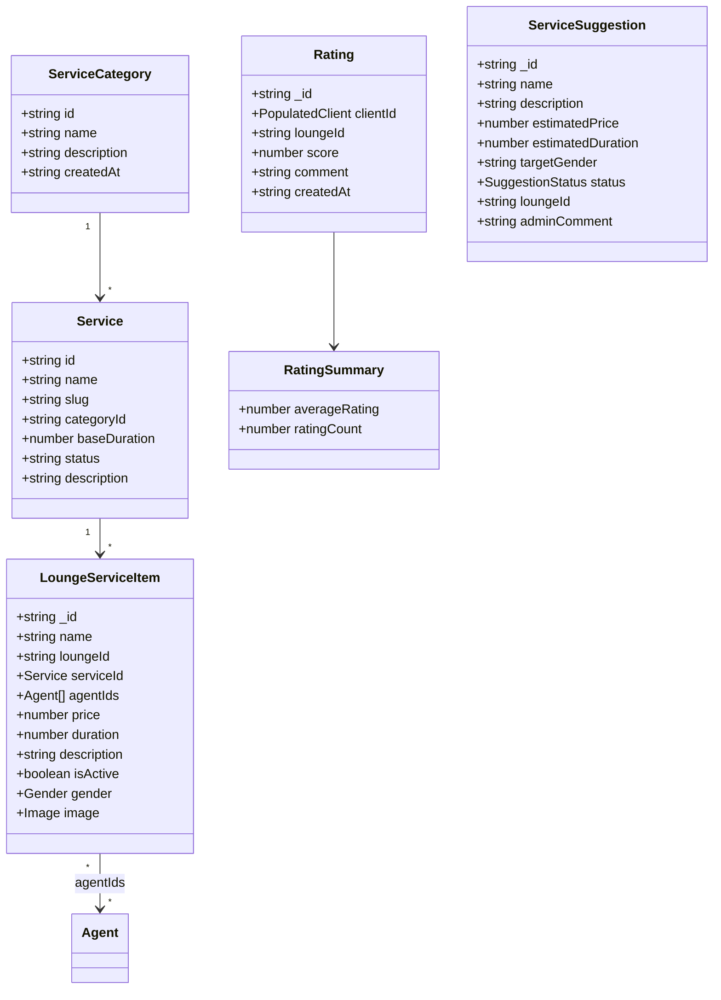
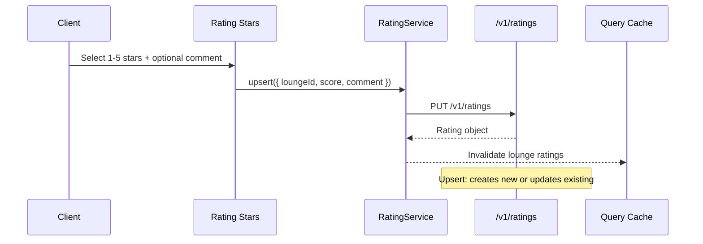
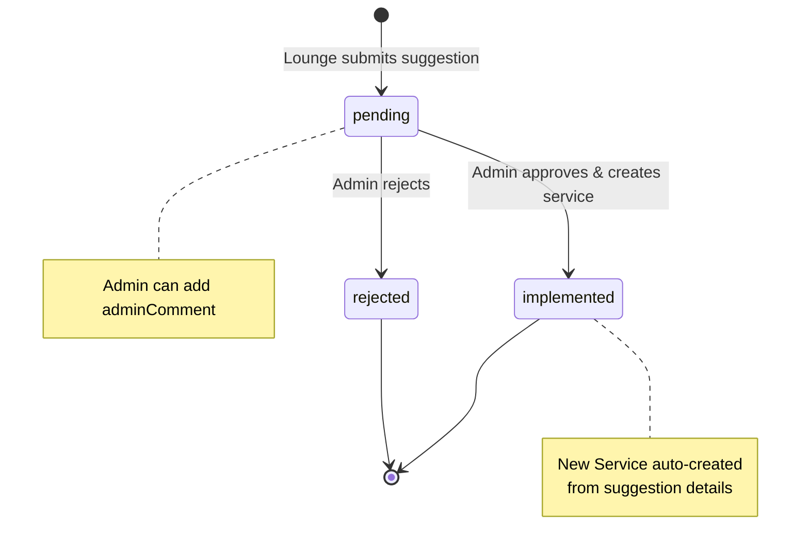
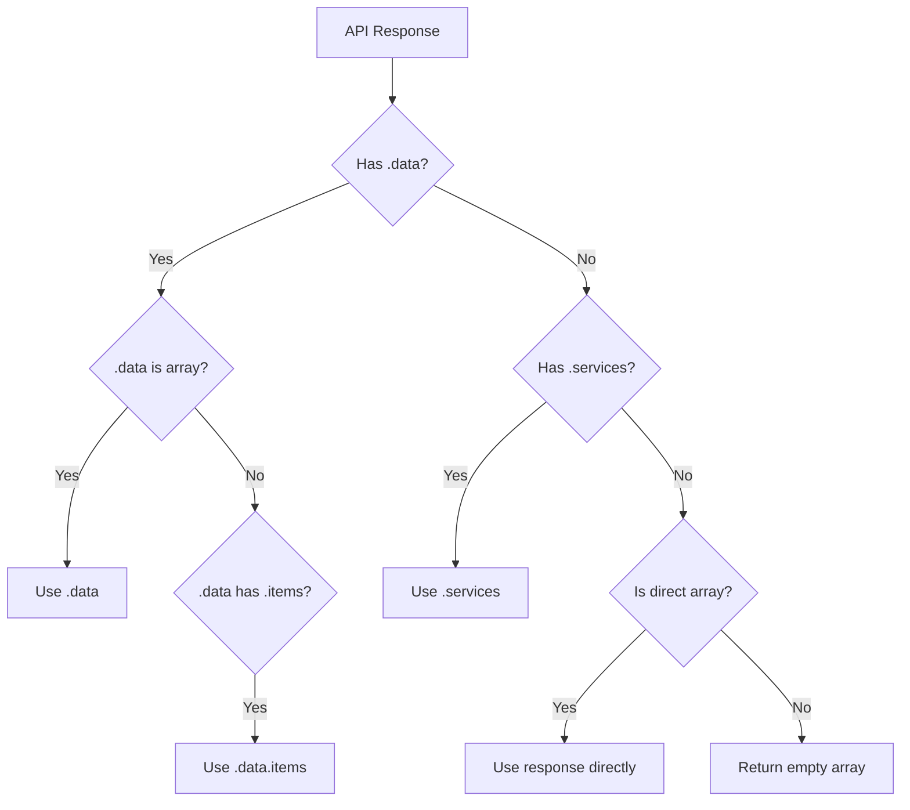

# Service Catalog System

The service catalog system manages the beauty service hierarchy — global service categories, global services, lounge-specific service offerings, ratings, and service suggestions.

---

## Architecture Overview



---

## Service Hierarchy



| Level | Scope | Example |
|-------|-------|---------|
| **ServiceCategory** | Global (admin-managed) | "Hair", "Nails", "Skin" |
| **Service** | Global (admin-managed) | "Haircut", "Manicure", "Facial" |
| **LoungeServiceItem** | Per-lounge customization | "Haircut" at Salon X — 25 TND, 30 min |

---

## Data Model



---

## Directory Structure

```
app/_systems/service-catalog/
├── index.ts                           Barrel exports
├── types/
│   ├── service.ts                     ServiceCategory, Service, LoungeServiceItem, DTOs
│   └── rating.ts                      Rating, RatingSummary, PaginatedRatings
├── hooks/
│   ├── useServices.ts                 Service & category query hooks
│   └── useRatings.ts                  Rating query & mutation hooks
├── constants/
│   └── service.ts                     Service-related constants
├── services/
│   ├── service.service.ts             Global service CRUD
│   ├── service-category.service.ts    Category CRUD
│   ├── service-suggestions.service.ts Suggestion CRUD + admin
│   └── rating.service.ts              Rating upsert + queries
└── components/
    └── services/
        ├── our-services.tsx            Lounge services display
        ├── service-item.tsx            Single service card
        ├── SuggestService.tsx          Suggestion form modal
        └── _lib/
            └── validate-suggestion.ts  Suggestion validation
```

---

## Service API Endpoints

### Service Categories (Admin)

| Method | Endpoint | Description |
|--------|----------|-------------|
| `getAll` | `GET /v1/service-categories` | All categories (public) |
| `getById` | `GET /v1/service-categories/:id` | Single category |
| `create` | `POST /v1/admin/service-categories` | Create category |
| `update` | `PUT /v1/admin/service-categories/:id` | Update category |
| `delete` | `DELETE /v1/admin/service-categories/:id` | Delete category |
| `search` | `GET /v1/admin/service-categories/search?q=` | Search categories |

### Global Services (Admin)

| Method | Endpoint | Description |
|--------|----------|-------------|
| `getAll` | `GET /v1/services` | All services (public) |
| `getById` | `GET /v1/services/:id` | Single service |
| `create` | `POST /v1/admin/services` | Create service |
| `update` | `PUT /v1/admin/services/:id` | Update service |
| `delete` | `DELETE /v1/admin/services/:id` | Delete service |
| `search` | `GET /v1/admin/services/search?q=` | Search services |
| `getByCategory` | `GET /v1/admin/services/category/:id` | By category |
| `bulkCreate` | `POST /v1/admin/services/bulk` | Bulk create |

### Ratings

| Method | Endpoint | Description |
|--------|----------|-------------|
| `upsert` | `PUT /v1/ratings` | Create or update rating |
| `remove` | `DELETE /v1/ratings/:loungeId` | Remove user's rating |
| `getLoungeRatings` | `GET /v1/ratings/lounge/:id?page&limit` | Lounge's ratings |
| `getMyRating` | `GET /v1/ratings/me/:loungeId` | User's rating for a lounge |

### Service Suggestions

| Method | Endpoint | Description |
|--------|----------|-------------|
| `create` | `POST /v1/service-suggestions` | Submit suggestion |
| `getAll` | `GET /v1/service-suggestions` | List suggestions |
| `getById` | `GET /v1/service-suggestions/:id` | Single suggestion |
| `update` | `PUT /v1/service-suggestions/:id` | Update suggestion |
| `delete` | `DELETE /v1/service-suggestions/:id` | Delete suggestion |
| `adminReview` | `PATCH /v1/admin/service-suggestions/:id` | Admin: approve/reject |

---

## Rating Flow



---

## Service Suggestion Flow



---

## Suggestion Validation

| Field | Rules |
|-------|-------|
| Name | Required, 2-100 characters |
| Description | Required, 10-500 characters |
| Estimated Price | Optional, positive number |
| Estimated Duration | Optional, positive integer (minutes) |
| Target Gender | Optional: "male", "female", "unisex", "kids" |

---

## Error Messages

| Constant | Codes |
|----------|-------|
| `SERVICE_CATEGORY_ERROR_MESSAGES` | `NOT_FOUND`, `ALREADY_EXISTS`, `IN_USE` |
| `SERVICE_ERROR_MESSAGES` | `NOT_FOUND`, `ALREADY_EXISTS`, `INVALID_CATEGORY` |
| `LOUNGE_SERVICE_ERROR_MESSAGES` | `NOT_FOUND`, `ALREADY_EXISTS`, `INVALID_SERVICE` |
| `SUGGESTION_ERROR_MESSAGES` | `NOT_FOUND`, `ALREADY_REVIEWED`, `INVALID_STATUS` |
| `RATING_ERROR_MESSAGES` | `NOT_FOUND`, `ALREADY_RATED`, `INVALID_SCORE` |

---

## Response Handling

All services implement flexible response parsing to handle backend variations:



All responses map `_id` → `id` for MongoDB compatibility.
