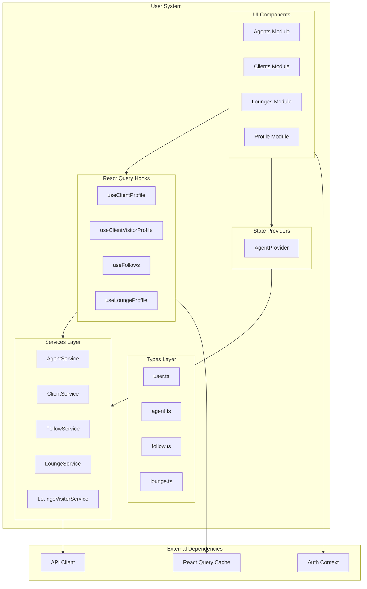
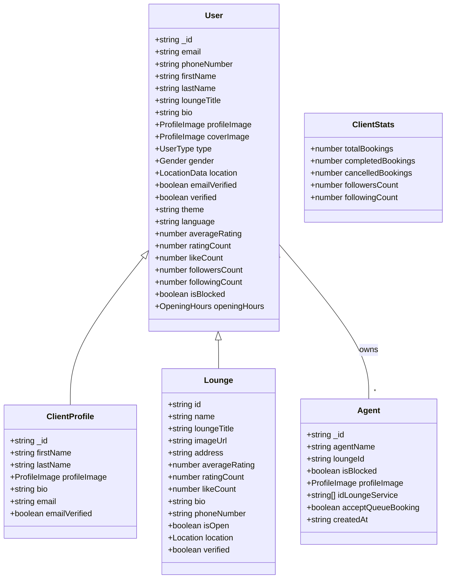
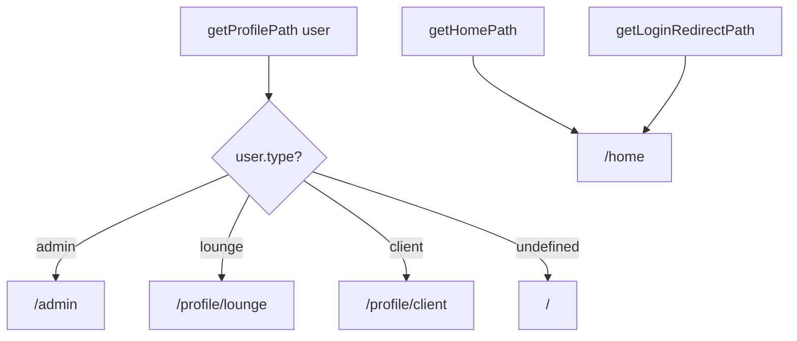
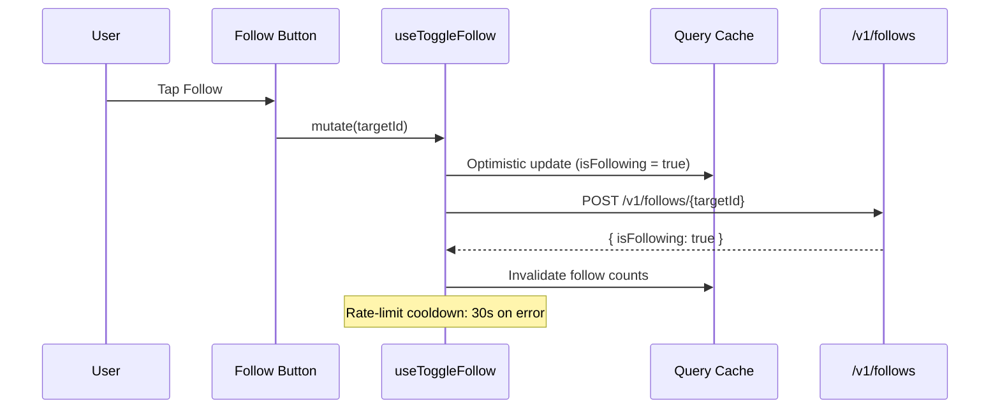
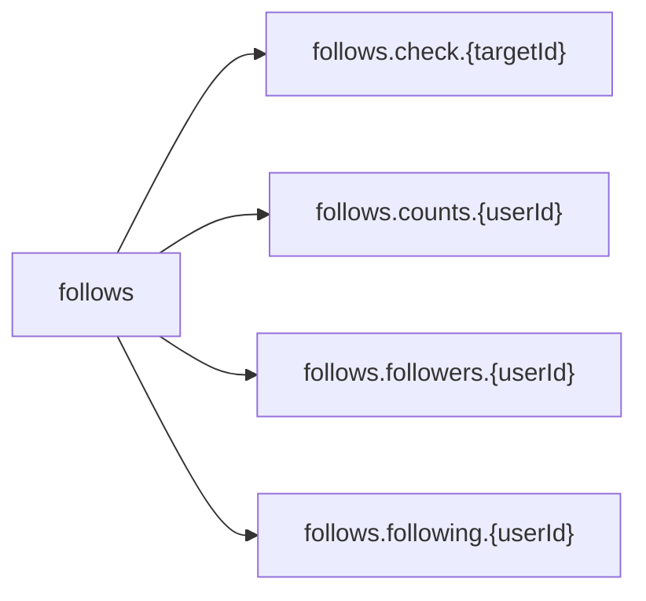
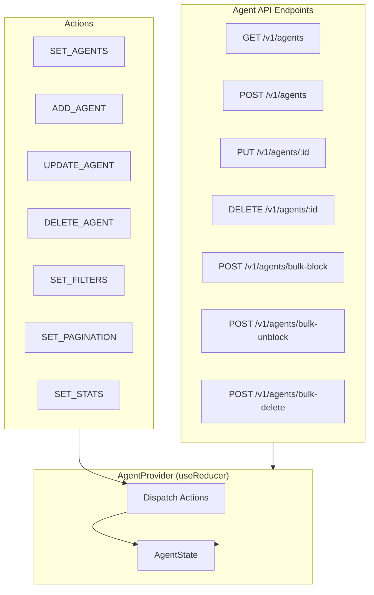
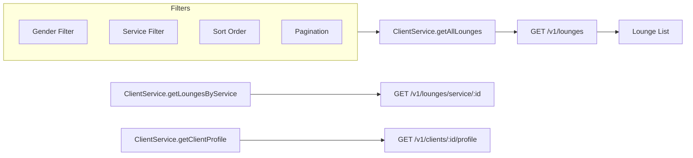
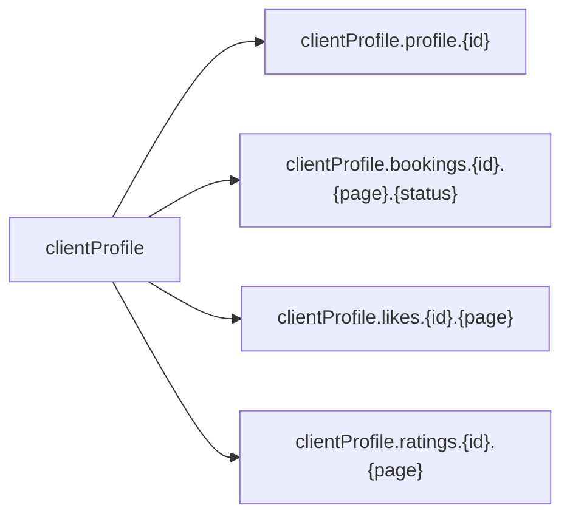
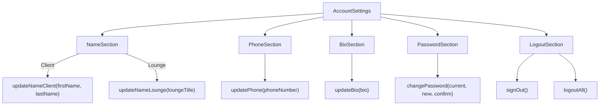

# User System

The user system manages user profiles (clients & lounges), agents, follow relationships, and lounge discovery for the Frame Beauty platform.

---

## Architecture Overview



---

## User Type Hierarchy



---

## Profile Routing Flow



---

## Directory Structure

```
app/_systems/user/
├── index.ts                              Barrel exports
├── types/
│   ├── user.ts                           User, ClientProfile, ClientStats
│   ├── agent.ts                          Agent, CreateAgentDto, AgentFilters
│   ├── follow.ts                         FollowToggleResult, PaginatedFollows
│   └── lounge.ts                         Lounge interface
├── services/
│   ├── agent.service.ts                  Agent CRUD + bulk operations
│   ├── client.service.ts                 Client/lounge discovery
│   ├── follow.service.ts                 Follow/unfollow + counts
│   ├── lounge.service.ts                 Lounge services, hours, agents
│   └── lounge-visitor.service.ts         Public lounge lookup
├── hooks/
│   ├── useClientProfile.ts               Client profile + mutations
│   ├── useClientVisitorProfile.ts        Visitor profile queries
│   ├── useFollows.ts                     Follow state + toggle
│   └── useLoungeProfile.ts              Lounge profile mutations
├── providers/
│   └── agent.tsx                         Agent state (useReducer)
├── lib/
│   └── profile.ts                        Profile routing helpers
└── components/
    ├── agents/                           Agent management UI
    ├── clients/                          Visitor profile views
    ├── lounges/                          Lounge cards & info
    └── profile/                          Own profile & settings
```

---

## Follow System



### Follow Query Keys



---

## Agent Management



### Agent Service Methods

| Method               | Endpoint                           | Description                 |
| -------------------- | ---------------------------------- | --------------------------- |
| `getAllAgents`       | `GET /v1/agents`                   | Paginated list with filters |
| `createAgent`        | `POST /v1/agents`                  | Create new agent            |
| `getAgentById`       | `GET /v1/agents/:id`               | Single agent details        |
| `updateAgent`        | `PUT /v1/agents/:id`               | Update agent fields         |
| `deleteAgent`        | `DELETE /v1/agents/:id`            | Remove agent                |
| `getAgentsByLounge`  | `GET /v1/agents/lounge/:id`        | Agents for a lounge         |
| `bulkBlockAgents`    | `POST /v1/agents/bulk-block`       | Block multiple agents       |
| `bulkUnblockAgents`  | `POST /v1/agents/bulk-unblock`     | Unblock multiple agents     |
| `bulkDeleteAgents`   | `POST /v1/agents/bulk-delete`      | Delete multiple agents      |
| `getAgentStats`      | `GET /v1/agents/stats`             | Agent statistics            |
| `updateQueueBooking` | `PUT /v1/agents/:id/queue-booking` | Toggle walk-in acceptance   |

### Agent Form Validation

| Field      | Rules                                       |
| ---------- | ------------------------------------------- |
| Agent Name | 2-50 chars, letters + spaces only           |
| Password   | 8+ chars, 1 uppercase, 1 lowercase, 1 digit |
| Image      | Max 5MB, image/\* MIME type                 |
| Services   | At least 1 required (create mode)           |

---

## Client Discovery



### Client Profile Query Keys



---

## Lounge Service Operations

| Method                  | Endpoint                            | Description                    |
| ----------------------- | ----------------------------------- | ------------------------------ |
| `getAll`                | `GET /v1/lounge-services`           | All lounge services            |
| `getById`               | `GET /v1/lounge-services/:id`       | Single service                 |
| `create`                | `POST /v1/services`                 | Create global service          |
| `createLoungeService`   | `POST /v1/lounge-services`          | Create lounge-specific service |
| `update`                | `PUT /v1/lounge-services/:id`       | Update service                 |
| `delete`                | `DELETE /v1/lounge-services/:id`    | Remove service                 |
| `getServiceSuggestions` | `GET /v1/service-suggestions`       | Service suggestions            |
| `getOpeningHours`       | `GET /v1/lounges/:id/opening-hours` | Opening hours                  |
| `updateOpeningHours`    | `PUT /v1/lounges/:id/opening-hours` | Update hours                   |
| `getAgentsByLoungeId`   | `GET /v1/agents/lounge/:id`         | Lounge agents                  |

---

## Profile Settings



### Profile Mutation Hooks

| Hook                          | Mutates               | Invalidates |
| ----------------------------- | --------------------- | ----------- |
| `useUpdateClientName`         | `PUT /v1/me/client`   | currentUser |
| `useUpdatePhone`              | `PUT /v1/me`          | currentUser |
| `useUpdateBio`                | `PUT /v1/me`          | currentUser |
| `useUpdateProfileImage`       | `PUT /v1/me/image`    | currentUser |
| `useUpdateLocation`           | `PUT /v1/me/location` | currentUser |
| `useUpdateGender`             | `PUT /v1/me`          | currentUser |
| `useUpdateLoungeTitle`        | `PUT /v1/me`          | currentUser |
| `useUpdateLoungeProfileImage` | `PUT /v1/me/image`    | currentUser |
| `useUpdateLoungeLocation`     | `PUT /v1/me/location` | currentUser |

---

## Component Modules

### Agents Module

- **AgentList**: Search with 500ms debounce, bulk actions (admin), pagination, delete confirmation
- **AgentTable**: Sortable columns, select-all checkbox, status badges, action dropdown
- **AgentForm**: Create/edit dialog with image upload, service selection, validation
- **AgentDetails**: Read-only dialog with full profile display
- **ImageSelector**: Click or drag-drop image upload with base64 conversion

### Clients Module (Visitor Profile)

- **VisitorProfileHeader**: Cover image, avatar, name, bio, follow button, follower counts
- **VisitorStatsCards**: Booking stats in card grid
- **VisitorOverviewTab**: Profile overview
- **VisitorBookingsTab**: Booking history
- **VisitorPostsTab**: User's posts

### Lounges Module

- **LoungeItem**: Lounge discovery card
- **FavoriteLoungesSection**: Horizontal carousel of favorites
- **DisplayLocation**: Map/address display
- **PopularServicesSection**: Top services carousel
- **ServiceCategoriesSection**: Category carousel

### Profile Module

- **UserInfo**: User menu card with avatar
- **AccountInformation**: Account details section
- **AccountSettings**: Settings tabs coordinator
- **UserSession**: Auth state display with sign-in/sign-up dialogs
- **UserPostsTab**: Infinite scroll user posts
- **UserReelsTab**: Grid display of user reels
